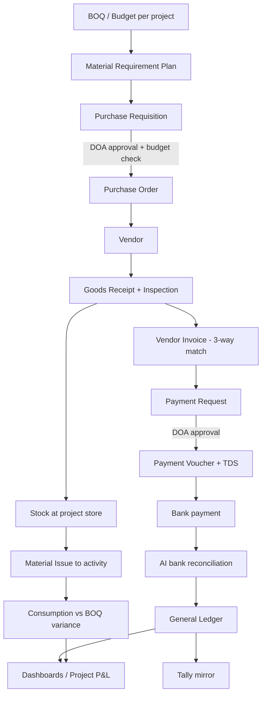

# Phase 1 — Business Requirement Document (BRD)

**Document ID:** AICOS-BRD-001 · **Version:** 1.0 · **Status:** Baseline for sign-off

---

## 1. Objective

Define, in business language, what the AI Construction Operating System must do, for whom, under what rules, and how success is measured — with sufficient precision that the Functional Design (Phase 2) can be written without re-interviewing the business.

**Business objective:** operate 3 → 500 projects with a single source of truth, one-time data entry, enforced approvals, complete auditability, and AI assistance — without increasing headcount proportionally.

---

## 2. Business context

### 2.1 Lines of business

| LOB | Description | Who owns the project P&L | Our revenue |
|---|---|---|---|
| **Self Redevelopment (PMC/DM)** | Society redevelops its own property; we manage | **Society** | Development-management / PMC fee (% of cost or fixed, milestone-linked) |
| **Society Redevelopment (Developer/JV)** | We take development rights | **Us** | Sale of free-sale component |
| **Development Management** | We manage another developer's project | Developer | DM fee |
| **Construction Management (PMC only)** | Execution supervision | Client | PMC fee |
| **Feasibility & Consultancy** | Feasibility reports, tender management, society consultancy | n/a | Professional fee |
| **Flat Sales** | Sale of our free-sale inventory (never brokerage) | Us | Sale consideration |

> **Design consequence (see Exec §C-4):** engagement model is a first-class attribute of a project. It changes ledger ownership, RERA obligation, GST treatment, revenue recognition and who signs cheques.

### 2.2 Organisation (current)

| Role | Person(s) | Operational responsibility |
|---|---|---|
| Director 1 | Sleeping Director | None operationally; statutory signatory (MCA, board resolutions, bank mandate) |
| **Director 2 — Executive Director** | 1 | BD, society meetings, redevelopment & self-redevelopment consulting, strategy, all approvals, payments, monitoring, vendor negotiation |
| Senior Accountant | 1 | Finalisation, GST, IT, TDS, MCA, RERA, legal documentation, flat-sale agreements, financials, compliance, audit, cash flow, reporting |
| Junior Accountant | 1 | Attendance reporting, Tally entries (bank/sales/purchase/journal), expense booking, payment register, labour payment register, collection register, demand letters, misc. data entry |
| Site Engineers | 2 (across 3 projects) | Planning, PR/PO, vendor & material follow-up, labour, DPR, quality, bar charts, bill certification, material requirement, approvals, progress reporting |
| HR | future | Attendance, recruitment, payroll, labour law, employee records |
| Sales | future | Society follow-up, customer follow-up, flat sales, leads, CRM |

### 2.3 Current systems

Tally (accounting) · Excel & Google Sheets (everything else) · WhatsApp (approvals, coordination, evidence) · Email · Google Drive (documents) · Bank portals (statements, payments). **No ERP.**

---

## 3. As-is processes and their failure points

### 3.1 Bank entry cycle

**Failures:** F-01 statement is unstructured PDF; F-02 no linkage between a bank line and the PR/PO/approval that caused it; F-03 narration-only classification, so project attribution is guesswork; F-04 reconciliation is retrospective, so errors surface weeks later; F-05 WhatsApp media auto-expiry loses evidence.

### 3.2 Payment cycle

**Failures:** F-06 approval evidence is a chat message (not auditable, not attributable to an amount/vendor/invoice); F-07 the same payment is recorded 3–4 times (chat → Excel → Tally → register); F-08 no duplicate-payment control — the same vendor invoice can be paid twice; F-09 no TDS/GST validation at approval time, so deductions are corrected retrospectively; F-10 no budget check against BOQ.

### 3.3 Procurement cycle

Engineer identifies requirement → WhatsApp to Director → verbal/chat approval → PO typed in Excel/email → vendor supplies → challan at site → invoice to accounts weeks later.

**Failures:** F-11 requirement not linked to BOQ, so consumption vs. estimate is never known; F-12 no rate comparison, no vendor quotation record; F-13 GRN quantity vs. PO quantity vs. invoice quantity three-way match does not exist; F-14 short supply / rejection has no record; F-15 stock at site is unknown, causing emergency purchases at premium rates.

### 3.4 Site reporting

Daily photos + text on WhatsApp groups; bar charts in Excel; measurements in site diary; RA bills certified on paper/PDF.

**Failures:** F-16 progress is anecdotal, not measured against schedule; F-17 no measurement-book trail behind certified bills; F-18 labour deployment is not costed to activity; F-19 quality/NCR observations vanish in chat scroll.

### 3.5 Society / member management

Member list, entitlement (carpet area), corpus, rent and shifting charges on spreadsheets; rent paid monthly by manual bank transfers.

**Failures:** F-20 no schedule engine — rent escalations missed or overpaid; F-21 no TDS on rent where applicable; F-22 members call the Director for status because there is no self-service; F-23 PAAA/agreement status not tracked against payment obligations.

### 3.6 Cross-cutting failures

F-24 data duplicated across Excel/Sheets/WhatsApp/Tally/memory · F-25 no role-based access (anyone with a Sheets link sees everything) · F-26 no audit trail · F-27 no centralised dashboard · F-28 no document version control · F-29 key-person risk concentrated in Senior Accountant and Director 2 · F-30 no early-warning on cost, cash, or schedule.

---

## 4. To-be operating model

### 4.1 Golden rules

| # | Rule |
|---|---|
| GR-1 | **Single source of truth.** Every fact has exactly one authoritative record. |
| GR-2 | **Capture once, at origin, by the person closest to the event.** |
| GR-3 | **Every transaction references masters** (project, vendor, item, cost head, BOQ line, GL account). Free-text is a last resort and is flagged. |
| GR-4 | **No financial state change without a human approval** recorded against a DOA rule. |
| GR-5 | **Everything is auditable**: who, what, when, from what value to what value, from which IP/device. |
| GR-6 | **AI drafts, never decides.** Confidence + source citation shown on every AI-produced field. |
| GR-7 | **Documents are attached to transactions**, not stored loose. |
| GR-8 | **Money is `NUMERIC(18,4)`**, never floating point; every amount carries currency and tax breakup. |
| GR-9 | **Nothing is hard-deleted.** Cancel/void with reason; soft-delete with retention. |
| GR-10 | **Budget is a control, not a report.** Breaches block, and unblock only via explicit deviation approval. |

### 4.2 The core operating loop (to-be)

### 4.3 Target process — payment (to-be)

| Step | Actor | System behaviour |
|---|---|---|
| 1 | Site Engineer / Accounts | Raise Payment Request against PO/RA bill/expense; AI pre-fills from invoice OCR; 3-way match runs |
| 2 | System | Validate: vendor active, GSTIN valid, budget available, TDS section & rate, duplicate-invoice check, bank details verified |
| 3 | System | Route by DOA (amount band × project × category); notify approver on web/mobile/WhatsApp |
| 4 | Approver | Approve / Reject / Return with reason — recorded immutably with the exact document snapshot |
| 5 | Accounts | Payment Voucher generated with TDS deduction; payment file / UPI / NEFT executed |
| 6 | System | Bank statement line auto-matched; GL posted; Tally mirrored; vendor notified; dashboards updated |

**Duplication eliminated:** 1 entry replaces 4.

---

## 5. Functional requirements catalogue

Priority: **M** = must (Wave 1) · **S** = should (Wave 2) · **C** = could (Wave 3) · **W** = won't (this release)

### 5.1 Platform & governance

| ID | Requirement | Pri |
|---|---|---|
| FR-PLT-001 | Multi-company (group entity, SPV, JV) with consolidated and per-entity reporting | M |
| FR-PLT-002 | Multi-project with project-level data isolation and cross-project roll-up | M |
| FR-PLT-003 | Role-based access with atomic permissions; a user may hold different roles on different projects | M |
| FR-PLT-004 | Delegation of Authority matrix: (entity, project, doc type, amount band, cost category) → approver chain | M |
| FR-PLT-005 | Configurable approval workflows (sequential, parallel, any-of-N, conditional) without code change | M |
| FR-PLT-006 | Immutable audit log of every create/update/approve/cancel with before/after values | M |
| FR-PLT-007 | Document numbering series per entity/project/doc-type/financial-year, gap-free | M |
| FR-PLT-008 | Financial-year and period locking; posting to a closed period blocked | M |
| FR-PLT-009 | Segregation-of-duties conflict detection and exception reporting | S |
| FR-PLT-010 | Maker-checker for master data changes (vendor bank account, GSTIN, rates) | M |
| FR-PLT-011 | Notification bus: in-app, email, WhatsApp, push, with per-user preferences and digests | M |
| FR-PLT-012 | Tenant-level configuration of statutory rates without deployment | S |

### 5.2 Masters

| ID | Requirement | Pri |
|---|---|---|
| FR-MST-001 | Company master: CIN, PAN, TAN, GSTINs (multi-state), registered address, signatories, DSC expiry | M |
| FR-MST-002 | Project master: engagement model, society link, RERA no., addresses, area statement (plot, FSI, TDR, fungible, carpet/built-up/saleable), milestones, project bank accounts | M |
| FR-MST-003 | Society master: registration no., committee members & tenure, member count, resolution register | M |
| FR-MST-004 | Member master: flat no., existing & entitled carpet area, corpus, rent schedule, PAN/Aadhaar (masked), agreement status | M |
| FR-MST-005 | Vendor master: type (supplier/contractor/consultant/labour), GSTIN with API validation, PAN, MSME/Udyam status, bank accounts (maker-checker), TDS section default, LDC certificate, categories, ratings | M |
| FR-MST-006 | Item master: category hierarchy, UOM + conversions, HSN/SAC, GST rate, brand/spec, reorder level, is-steel/is-cement flags for reconciliation | M |
| FR-MST-007 | Cost head / WBS master mapped to BOQ groups and GL accounts | M |
| FR-MST-008 | Chart of accounts, mapped 1:1 to Tally ledgers | M |
| FR-MST-009 | Employee master (basic in W1, full HR in W3) | S |
| FR-MST-010 | Customer master for flat sales | C |
| FR-MST-011 | Rate contract / price list per vendor per item with validity | S |

### 5.3 Planning & BOQ

| ID | Requirement | Pri |
|---|---|---|
| FR-PLN-001 | Import BOQ from Excel with mapping template; validate UOM, rate, amount | M |
| FR-PLN-002 | BOQ hierarchy (group → sub-group → item) with quantity, rate, amount, and cost-head mapping | M |
| FR-PLN-003 | Budget = approved BOQ; revisions versioned with approval and variance-from-baseline | M |
| FR-PLN-004 | Activity schedule (WBS, dependencies, planned start/finish, weightage) — bar chart / Gantt | S |
| FR-PLN-005 | Material requirement derived from BOQ via item-consumption norms (e.g. cement bags/m³) | S |
| FR-PLN-006 | Baseline vs revised vs actual schedule comparison; S-curve | S |
| FR-PLN-007 | Import from MS Project / Primavera XER (read) | C |

### 5.4 Procurement

| ID | Requirement | Pri |
|---|---|---|
| FR-PRC-001 | Purchase Requisition against project + BOQ line + required-by date, raised on mobile | M |
| FR-PRC-002 | Real-time budget availability check at PR submission and at approval | M |
| FR-PRC-003 | Stock availability check across project stores before purchase (suggest inter-project transfer) | S |
| FR-PRC-004 | RFQ to multiple vendors; quotation capture; comparative statement with recommendation | S |
| FR-PRC-005 | PO from approved PR (full/partial); amendment with version history and re-approval | M |
| FR-PRC-006 | PO terms: payment terms, delivery schedule, freight, retention, penalty, warranty | M |
| FR-PRC-007 | PO dispatch to vendor by email/WhatsApp with acknowledgement tracking | M |
| FR-PRC-008 | Work Order for contractors (rate-based/lump-sum) with BOQ, retention %, mobilisation advance | S |
| FR-PRC-009 | Vendor performance scoring: on-time %, quality rejection %, price variance, responsiveness | S |
| FR-PRC-010 | Blacklist / hold vendor with reason; blocked from new POs | S |

### 5.5 Materials & inventory

| ID | Requirement | Pri |
|---|---|---|
| FR-MAT-001 | GRN against PO with challan; short/excess/rejection with reason; mobile capture with photo | M |
| FR-MAT-002 | Quality inspection step (accept/reject/conditional) with test certificate attachment | S |
| FR-MAT-003 | Project store stock ledger: opening, receipt, issue, return, transfer, adjustment, closing | M |
| FR-MAT-004 | Material Issue to WBS/activity/contractor with issuing authority | M |
| FR-MAT-005 | Inter-project material transfer with in-transit state | S |
| FR-MAT-006 | Physical stock verification with variance approval | S |
| FR-MAT-007 | Theoretical vs actual consumption variance per material (steel BBS, cement grade-wise) | S |
| FR-MAT-008 | Valuation: weighted average (default), FIFO configurable | M |
| FR-MAT-009 | Material returned by contractor / to vendor (debit note) | S |
| FR-MAT-010 | Reorder alerts using lead time and consumption run rate | C |

### 5.6 Site execution

| ID | Requirement | Pri |
|---|---|---|
| FR-SIT-001 | Daily Progress Report: manpower by trade, equipment, activities with quantity done, weather, photos, delays | M |
| FR-SIT-002 | Offline capture on mobile with queued sync | S |
| FR-SIT-003 | Measurement Book: measurement entries against BOQ items feeding RA bills | S |
| FR-SIT-004 | Contractor RA bill: measurement → certification → deductions (retention, advance recovery, penalty, material issued) → net payable | S |
| FR-SIT-005 | Quality NCR / snag list with assignment and closure | S |
| FR-SIT-006 | Safety incident register, toolbox talks, BOCW compliance evidence | C |
| FR-SIT-007 | Labour muster: contractor-wise headcount, attendance, wage rate, gang-wise deployment | S |
| FR-SIT-008 | Site instruction / hindrance register with client & consultant | C |
| FR-SIT-009 | Photo/geo/timestamp watermarking for progress evidence | S |

### 5.7 Finance & accounts

| ID | Requirement | Pri |
|---|---|---|
| FR-FIN-001 | Double-entry GL with dimensions: entity, project, cost head, vendor, BOQ line | M |
| FR-FIN-002 | Purchase/expense booking from GRN + invoice with 3-way match tolerance rules | M |
| FR-FIN-003 | Payment Request → approval → Payment Voucher with TDS auto-computation | M |
| FR-FIN-004 | Advance payments and their adjustment against invoices | M |
| FR-FIN-005 | Bank statement ingestion (PDF/CSV/MT940) with AI parsing and reconciliation suggestions | M |
| FR-FIN-006 | Duplicate payment detection (vendor + invoice no. + amount + fuzzy) before approval | M |
| FR-FIN-007 | Tally two-way *mapping*, one-way *sync* (AI-COS → Tally), with reconciliation report | M |
| FR-FIN-008 | Project-wise P&L, cash flow, cost-to-complete, committed vs incurred vs paid | M |
| FR-FIN-009 | Collections: demand letters, receipts, ageing, interest on delayed payment | C |
| FR-FIN-010 | Member disbursements: rent (with escalation), corpus, shifting, brokerage — schedule + payment run | M |
| FR-FIN-011 | Budget vs actual with commitment accounting (PO = commitment) | M |
| FR-FIN-012 | Petty cash / imprest per site with replenishment workflow | S |
| FR-FIN-013 | Cash-flow forecast 13-week rolling, driven by PO schedule + collections + member payouts | S |
| FR-FIN-014 | RERA designated-account (70:30) tracking with withdrawal certification | C |
| FR-FIN-015 | Retention money register and release schedule (DLP-linked) | S |

### 5.8 Statutory & compliance

| ID | Requirement | Pri |
|---|---|---|
| FR-CMP-001 | GST: input tax credit register, GSTR-2B reconciliation, RCM (incl. 80% procurement rule for promoters), e-invoice & e-way bill via GSP | S |
| FR-CMP-002 | TDS engine: section-wise rates, thresholds, LDC handling, challan, Form 26Q/27Q data, TDS certificates | S |
| FR-CMP-003 | Compliance calendar with owner, due date, escalation (GST, TDS, ROC, RERA QPR, PF/ESIC, professional tax) | M |
| FR-CMP-004 | RERA: project registration data, quarterly progress report pack, Form 1/2/3 inputs, agreement register | C |
| FR-CMP-005 | Statutory register: board resolutions, DIN, DSC expiry, bank mandates | S |
| FR-CMP-006 | Labour: BOCW cess, PF/ESIC for contract labour, licence validity tracking | C |
| FR-CMP-007 | Legal: agreement lifecycle (draft → vetted → executed → registered), stamp duty, registration numbers, renewal alerts | S |

### 5.9 Documents, reporting, AI

| ID | Requirement | Pri |
|---|---|---|
| FR-DOC-001 | Central document repository, transaction-linked, versioned, full-text + semantic search | M |
| FR-DOC-002 | Retention policy and legal hold | C |
| FR-DOC-003 | Template-driven document generation (PO, WO, demand letter, PAAA annexure, certificates) | S |
| FR-RPT-001 | Role-based dashboards (Director, Accounts, Engineer, Society) | M |
| FR-RPT-002 | Standard report pack (§11) exportable to Excel/PDF, schedulable by email/WhatsApp | M |
| FR-RPT-003 | Ad-hoc report builder with saved views and permissions | C |
| FR-AI-001 | Document AI: invoice, bank statement, challan, GRN, agreement extraction with confidence + citation | M |
| FR-AI-002 | AI reconciliation assistant for bank lines | M |
| FR-AI-003 | Conversational assistant over the user's permitted data ("show overdue POs on Project A") | S |
| FR-AI-004 | Predictive: cash-flow, material requirement, schedule delay, cost overrun, vendor risk | C |
| FR-AI-005 | AI meeting assistant: transcript → minutes → action items → tasks | C |
| FR-AI-006 | AI anomaly detection: duplicate payments, rate outliers, unusual consumption, split-PO avoidance of DOA | S |

---

## 6. Business rules (extract — full engine in Phase 12)

| ID | Rule | Enforcement |
|---|---|---|
| BR-001 | A PR cannot be approved if cumulative committed + incurred cost exceeds the BOQ line budget, unless a Budget Deviation Approval exists | Block |
| BR-002 | A PO can only be raised against an approved PR; quantity ≤ approved PR quantity | Block |
| BR-003 | GRN quantity cannot exceed PO quantity + tolerance (default 2%, configurable per item) | Block |
| BR-004 | Vendor invoice is payable only after 3-way match (PO ↔ GRN ↔ Invoice) within tolerance | Block, override with approval |
| BR-005 | Same (vendor, invoice number, financial year) cannot be booked twice | Block |
| BR-006 | TDS is deducted at the section rate applicable to the vendor's category and threshold state; nil/lower only with a valid LDC on file within its validity and limit | Auto + block |
| BR-007 | Payment cannot exceed (invoice − TDS − retention − advance adjusted − debit notes) | Block |
| BR-008 | Vendor bank account changes require maker-checker plus a 24-hour cooling period before use in a payment | Block |
| BR-009 | Approval authority is derived from the DOA matrix at submission time and frozen on the document | Record |
| BR-010 | A user cannot approve a document they created, unless an SoD exception is explicitly recorded | Warn + log |
| BR-011 | Splitting a requirement into multiple PRs to stay below an approval band is detected (same item + project + 7 days) and escalated | Alert |
| BR-012 | Posting into a locked accounting period is blocked; reversal must be in an open period | Block |
| BR-013 | For registered promoters, if annual procurement from registered suppliers < 80%, RCM at 18% applies on the shortfall | Compute + alert |
| BR-014 | Member rent escalates per the agreement's clause on the anniversary date; missed months accrue as arrears | Auto |
| BR-015 | In self-redevelopment (society-owned funds), our entity's GL records fee income only; society funds are tracked in a separate FUM ledger, never mixed into our P&L | Structural |
| BR-016 | Retention is released only after DLP expiry and NOC, in two tranches by default (50% on virtual completion, 50% on DLP end) | Workflow |
| BR-017 | Cash payment to a single person exceeding ₹10,000/day is blocked (Sec 40A(3)) | Block |
| BR-018 | Documents cannot be deleted once referenced by an approved transaction | Block |

---

## 7. User roles (business view)

| Role | Primary screens | Key permissions |
|---|---|---|
| **Executive Director** | Approval inbox, portfolio dashboard, cash position, exception feed | Approve all bands, view all projects, override with reason |
| **Sleeping Director / Board** | Board pack, statutory register | Read-only + statutory sign-off |
| **Senior Accountant** | Compliance calendar, GST/TDS workbench, GL, financials, Tally sync | Post, finalise, file, configure statutory masters |
| **Junior Accountant** | Invoice inbox, bank reconciliation, payment run, registers | Create/book, cannot approve payments |
| **Site Engineer** | Mobile DPR, PR, GRN, issue, measurement, RA bill certification | Create site & procurement docs for assigned projects |
| **Project Manager** (future) | Project dashboard, schedule, budget | Approve within project band |
| **Store Keeper** (future/composite) | GRN, issue, stock | Inventory only |
| **HR** (future) | Attendance, payroll, employee records | HR domain |
| **Sales / CRM** (future) | Leads, customers, bookings, collections | Sales domain |
| **Society Committee** (external portal) | Project progress, fund utilisation, member ledger | Read-only, scoped to their society |
| **Vendor** (external portal) | POs, GRN status, invoice submission, payment status | Scoped to self |
| **Auditor** | Audit trail, registers, document vault | Read-only, all history, no mutation |
| **System Admin** | Configuration, users, DOA, integrations | No financial approval rights |

---

## 8. Non-functional requirements

| ID | Category | Requirement |
|---|---|---|
| NFR-001 | Scale | 500 concurrent users, 1,000+ active projects, 50M+ ledger rows, 10M+ documents |
| NFR-002 | Performance | P95 < 400 ms for transactional reads; < 1.2 s for list screens of 10k rows (paginated); dashboards < 3 s |
| NFR-003 | Availability | 99.5% Wave 1 → 99.9% Wave 3, business hours IST critical |
| NFR-004 | RPO / RTO | RPO ≤ 5 min (PITR), RTO ≤ 4 h |
| NFR-005 | Security | Encryption at rest (KMS) and in transit (TLS 1.3); MFA for finance roles; least privilege; secrets in a vault |
| NFR-006 | Data residency | All primary data and backups in India (`ap-south-1`), per DPDP Act 2023 |
| NFR-007 | Auditability | Append-only audit log retained 8 years (Companies Act) |
| NFR-008 | Mobile | Android 10+ / iOS 15+; usable on 3G; offline site capture |
| NFR-009 | Accessibility | WCAG 2.1 AA for web; ≥16 px touch-friendly targets on mobile |
| NFR-010 | Localisation | English + Hindi + Marathi UI strings; Indian number format (lakh/crore); DD-MM-YYYY; IST |
| NFR-011 | AI governance | Every AI output carries model, prompt version, confidence, and source citation; full replay possible |
| NFR-012 | Extensibility | New document type / workflow / report addable by configuration in < 1 day |
| NFR-013 | Interoperability | Open REST + webhooks; Tally, GSP, bank, WhatsApp, e-sign connectors |
| NFR-014 | Data retention | Financial records 8 years; RERA records 5 years post-completion; documents per legal-hold policy |

---

## 9. Integrations required

| System | Direction | Method | Wave |
|---|---|---|---|
| Tally Prime | AI-COS → Tally | Local connector agent → Tally HTTP XML gateway (port 9000) | W1 |
| Bank statements | Bank → AI-COS | CSV/PDF/MT940 upload; Account Aggregator later | W1 |
| WhatsApp Business API | Both | BSP (Meta Cloud API via BSP) with approved templates | W2 |
| GSP (GST) | Both | e-invoice IRN, e-way bill, GSTR-2B download | W2 |
| Email | Both | SES outbound; IMAP inbox for invoice capture | W1 |
| e-Sign / DSC | Both | NSDL/Aadhaar e-sign for agreements | W3 |
| Bank payment initiation | AI-COS → Bank | H2H file / corporate API | W3 |
| MahaRERA | Manual/portal | Report pack generation (no public API) | W3 |
| Payment gateway (customer collections) | Both | Razorpay/PayU | W3 |

---

## 10. Assumptions, dependencies, constraints

**Assumptions:** A-01 statutory rates change annually and must be configurable, never hard-coded · A-02 site connectivity is intermittent but not absent · A-03 vendors will accept email/WhatsApp PO delivery; portal adoption will be gradual · A-04 Tally remains in use through Wave 3 · A-05 existing Excel data is incomplete and will require cleansing.

**Dependencies:** D-01 GSP contract · D-02 WhatsApp BSP approval and template review (2–4 weeks) · D-03 bank statement formats from each bank · D-04 access to a Windows host for the Tally connector · D-05 business availability for UAT.

**Constraints:** CN-01 small operational team — training time is scarce, so UX must be self-evident · CN-02 go-live cannot disrupt statutory filing cycles; cut over at a month/quarter end · CN-03 budget discipline — infrastructure must start small.

---

## 11. Reports required (business list; specs in Phase 2)

**Director:** portfolio health · cash position & 13-week forecast · pending approvals ageing · cost overrun exceptions · project physical vs financial progress · top-20 vendor exposure · member payout obligations.

**Accounts:** trial balance, P&L, balance sheet (entity & project) · bank reconciliation statement · TDS deduction & payable · GST ITC and RCM liability · vendor ageing & payable · advance outstanding · retention register · collection ageing · Tally sync exception.

**Site:** DPR & weekly progress · material consumption vs BOQ · stock statement & slow-moving · PO pendency · GRN pending inspection · labour deployment & productivity · RA bill status · NCR/snag ageing.

**Compliance:** compliance calendar status · RERA QPR pack · statutory register · document expiry (LDC, licences, insurance, DSC).

---

## 12. Dashboards

| Dashboard | Key tiles |
|---|---|
| Executive | Cash on hand & runway · approvals waiting on me · projects at risk (RAG) · committed vs budget · this month's outflow · AI exception feed |
| Project | Physical % vs planned (S-curve) · budget vs committed vs incurred · open PRs/POs · stock value · manpower trend · milestone tracker |
| Accounts | Unreconciled bank lines · invoices awaiting match · TDS/GST due · period-close checklist · Tally sync health |
| Site | Today's DPR status · material due-in · issues pending · open NCRs · labour count |
| Society/Member | Members onboarded · rent paid vs due · corpus disbursed · agreement status · possession tracker |

---

## 13. AI opportunities (business framing)

| Opportunity | Value | Risk control |
|---|---|---|
| Invoice & challan OCR → draft booking | Removes the largest keying load | Human approval; confidence threshold; three-way match |
| Bank statement parsing + reconciliation | Removes weeks of retrospective work | Suggest-only; auto-post only above 0.95 confidence and exact amount+ref match |
| Approval summariser ("what am I approving?") | Faster, better-informed Director decisions | Read-only summary with links to source |
| Duplicate & anomaly detection | Prevents real cash loss | Alerts, never auto-block without rule backing |
| Cash-flow prediction | Prevents liquidity surprises | Presented as a range with drivers |
| Material & delay prediction | Prevents emergency purchases and idle labour | Advisory |
| Document drafting (PO, demand letter, MoM) | Saves professional time | Template-locked; human sign-off |
| Conversational query over ERP data | Removes report-request queue | Enforced by the same row-level permissions as the UI |

---

## 14. Security requirements (business view)

SEC-01 every user is uniquely identified; no shared logins · SEC-02 MFA mandatory for approval and finance roles · SEC-03 vendor bank details are sensitive data with maker-checker and change alerts to the Director · SEC-04 PAN/Aadhaar masked by default, unmask is a logged privileged action · SEC-05 external portals see only their own scope · SEC-06 all downloads/exports are logged with watermark · SEC-07 session timeout and device binding for mobile · SEC-08 quarterly access review by the Senior Accountant · SEC-09 AI must never be able to mutate financial state directly · SEC-10 breach/incident response plan with defined notification obligations.

---

## 15. Future enhancements

Drone/360° progress capture with automatic %-complete estimation · IoT (batching plant, weighbridge, fuel) · BIM/IFC model linkage to BOQ and progress · Primavera/MSP two-way sync · e-procurement marketplace and reverse auctions · society member mobile app with voting · bank/NBFC integration for project finance drawdowns · white-labelled SaaS for other redevelopment firms · benchmarked rate intelligence across projects · ESG and green-building compliance tracking.

---

## 16. Sign-off

| Role | Name | Date | Signature |
|---|---|---|---|
| Executive Director | | | |
| Senior Accountant | | | |
| Site Engineering Lead | | | |
| Project Sponsor | | | |
