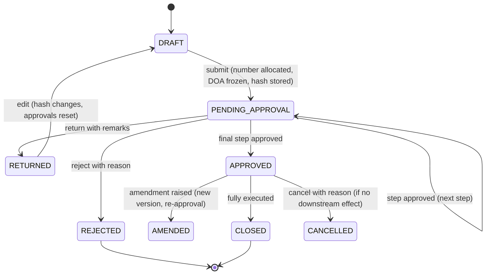
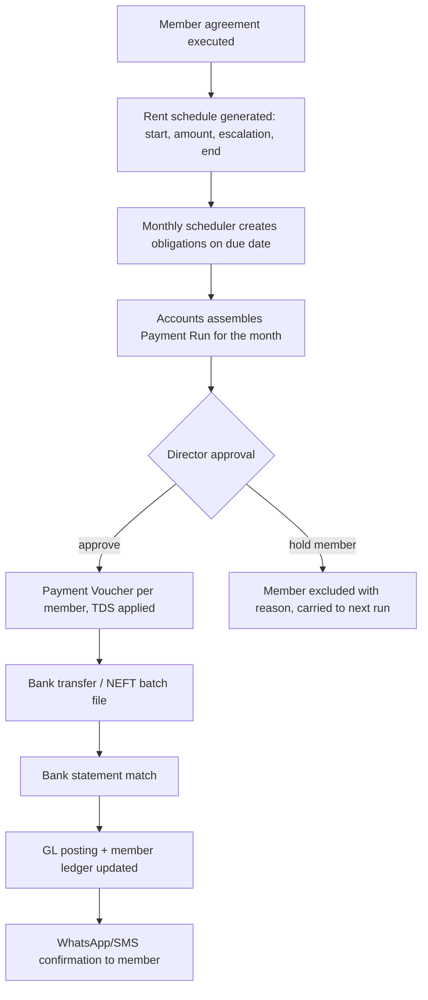
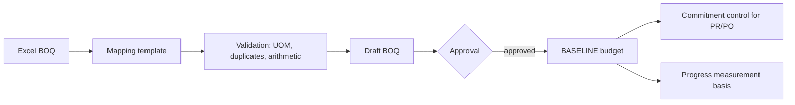
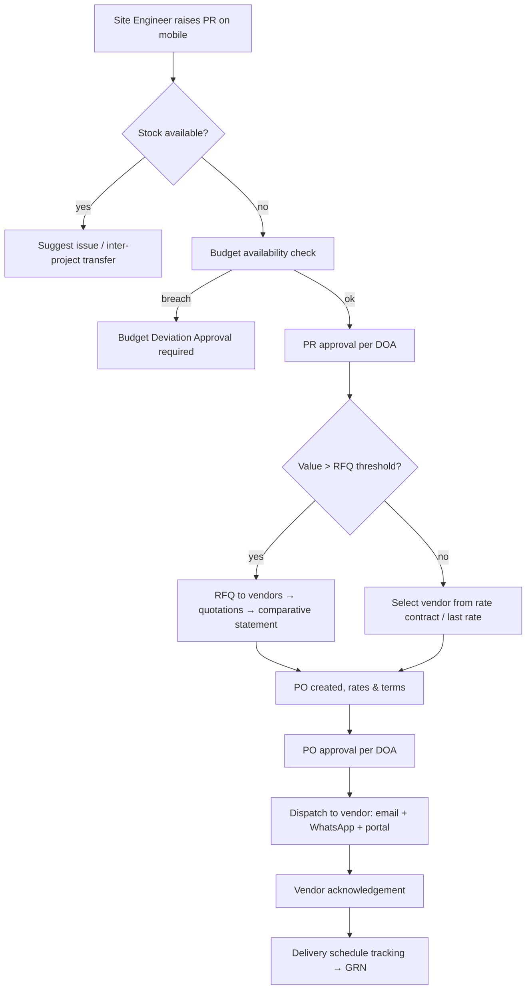
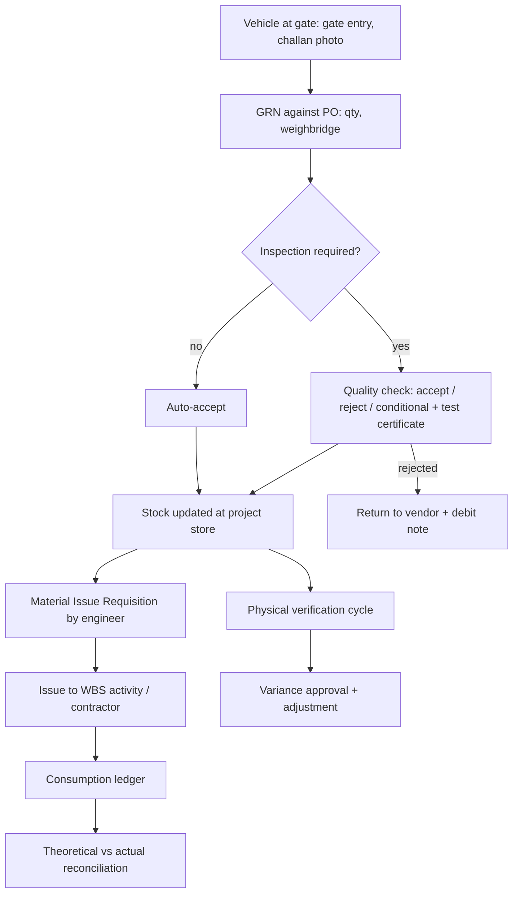

# Phase 2A — Functional Design Specification: Core Operating Modules

**Document ID:** AICOS-FDS-A · **Version:** 1.0
**Covers:** Platform Foundation · Masters · Project & Society/Member · Planning & BOQ · Procurement · Materials & Inventory

Each module follows the mandated 15-point structure.

---

# M01 — Platform Foundation (Tenancy, Identity, RBAC, DOA, Workflow, Audit, Numbering)

### 1. Objective
Provide the shared spine every other module depends on: who the user is, what they may see, what they may do, who must approve, what number the document gets, and what was recorded about the action.

### 2. Functional requirements
- FR-PLT-001…012 (BRD §5.1).
- Tenant → Company (legal entity) → Project hierarchy; a user's access is granted at any level and inherited downward.
- Permission model: `permission = module.action` (e.g. `purchase_order.approve`), atomic; roles are named bundles; assignments are scoped `(user, role, scope_type, scope_id)`.
- DOA matrix evaluated at submission: input `(company, project, doc_type, amount, cost_category, budget_state)` → ordered approver steps.
- Workflow engine: state machine per document type, defined as data (states, transitions, guards, actions, SLA, escalation).
- Numbering: `{PREFIX}/{ENTITY}/{PROJECT}/{FY}/{SEQ}` — e.g. `PO/DEVT/GKS/25-26/00042`; sequence allocated on **submit**, not on draft, and is gap-free per series.
- Audit: append-only, JSON before/after diff, actor, ip, user-agent, request-id, correlation with the document version.

### 3. Business rules
| ID | Rule |
|---|---|
| BR-PLT-01 | Every query is tenant-scoped at the database layer (RLS). No application code may bypass it. |
| BR-PLT-02 | The DOA chain is resolved and **frozen onto the document** at submission; later DOA edits do not retroactively change in-flight documents. |
| BR-PLT-03 | If no DOA rule matches, the document routes to the entity's default approver and raises a configuration alert. |
| BR-PLT-04 | Approval steps record the document's content hash; if the document changes after approval, prior approvals are invalidated and re-approval is required. |
| BR-PLT-05 | Sequence numbers are never reused; a cancelled document retains its number with status `CANCELLED`. |
| BR-PLT-06 | Delegation (e.g. Director on leave) is time-bounded, logged, and shows "approved by X on behalf of Y". |
| BR-PLT-07 | Period lock blocks posting; a `FINANCE_ADMIN` may reopen with reason, which is audited and reported. |

### 4. Workflow

### 5. Database tables
`tenant`, `company`, `user_account`, `role`, `permission`, `role_permission`, `user_role_assignment`, `doa_rule`, `approval_workflow`, `approval_step`, `approval_instance`, `approval_action`, `delegation`, `number_series`, `number_sequence`, `audit_log`, `financial_period`, `attachment`, `notification`, `notification_preference`, `outbox_event`, `sod_exception`.

### 6. Relationships
`tenant 1—N company 1—N project`; `user_account N—M role` via `user_role_assignment` with `(scope_type, scope_id)`; `approval_instance` polymorphic to `(document_type, document_id)`; `audit_log` polymorphic to any entity; `number_series` unique on `(company, project?, doc_type, fy)`.

### 7. API
`POST /auth/login` · `POST /auth/mfa/verify` · `GET /me/permissions` · `GET/POST /admin/roles` · `POST /admin/doa-rules` · `POST /admin/doa-rules:simulate` (dry-run a document against the matrix) · `GET /approvals/inbox` · `POST /approvals/{id}/approve|reject|return` · `POST /approvals/bulk-approve` · `GET /audit?entity=&id=` · `GET /admin/number-series`.

### 8. UI screens
Login & MFA · Tenant/company switcher · Role & permission designer (matrix grid) · DOA matrix builder with simulator · Workflow designer (visual state machine) · **Approval Inbox** (the Director's home screen: card list, swipe approve on mobile, bulk approve, AI summary per card) · Audit trail viewer (timeline + field diff) · Number series config · Period close console.

### 9. User roles
`SYSTEM_ADMIN` (config, no approvals) · `TENANT_OWNER` · every functional role consumes this module read-only.

### 10. Validation rules
Unique email/phone per tenant · password policy + MFA enrolment for finance roles · role cannot grant a permission the assigner lacks · DOA amount bands must be contiguous and non-overlapping per (doc_type, project) · workflow must have exactly one terminal approved state · number series prefix `^[A-Z0-9/-]{2,20}$`.

### 11. Reports
Access matrix by user · SoD conflict report · approval TAT (turnaround) by approver and document type · overdue approvals · audit extract for a date range/entity · period-close status · delegation register.

### 12. Dashboards
Admin health: failed logins, MFA coverage, stale roles, pending approvals ageing, workflow SLA breaches.

### 13. AI opportunities
Approval summariser ("₹4.2L to Shree Steel for 12 MT TMT against PO-…, 8% above last rate, budget 74% consumed") · anomaly detection on approval patterns (bulk approvals at odd hours, split documents) · natural-language DOA authoring ("engineers up to 50 thousand, director above") converted into rules for confirmation.

### 14. Security requirements
RLS on every table · JWT with short TTL + refresh rotation · MFA (TOTP/SMS) enforced by role · privileged actions re-authenticated (step-up auth) · IP/device recorded · audit log append-only (DB revoke UPDATE/DELETE) with periodic hash-chain anchoring · session invalidation on role change.

### 15. Future enhancements
SSO/SAML for enterprise tenants · policy-as-code (OPA) for complex DOA · attribute-based access control · approval via e-sign for statutory documents · SCIM provisioning.

---

# M02 — Master Data Management

### 1. Objective
Guarantee that every transaction references controlled, deduplicated, validated master data — the precondition for "never duplicate data".

### 2. Functional requirements
FR-MST-001…011. Masters: Company, Project, Society, Member, Vendor/Contractor, Item, UOM & conversion, Cost head/WBS, Chart of Accounts, Employee, Customer, Bank Account, Tax master, Rate contract, Location/Store.
Additional: maker-checker on sensitive fields; merge-duplicates utility; effective-dated attributes (GST rate, TDS rate, item price); bulk import with validation report; master change history.

### 3. Business rules
| ID | Rule |
|---|---|
| BR-MST-01 | Vendor is unique on PAN; GSTIN must be 15 chars and validated against the GSTN API (status must be Active) before first transaction. |
| BR-MST-02 | Vendor bank account add/change requires maker-checker + 24 h cooling period + notification to the Executive Director. |
| BR-MST-03 | Item code is system-generated and immutable; description changes are versioned. |
| BR-MST-04 | A master cannot be deleted once referenced; it can only be deactivated (blocking new use, preserving history). |
| BR-MST-05 | UOM conversions are defined per item (e.g. cement: bag ↔ MT at 0.05); transactions store both entry UOM and base UOM quantity. |
| BR-MST-06 | Effective-dated rates are selected by document date, never by system date. |
| BR-MST-07 | MSME/Udyam vendors are flagged; payment beyond 45 days triggers a Section 43B(h) alert. |

### 4. Workflow
Create (draft) → validation (format + external API) → maker-checker approval for sensitive classes (vendor, bank account, COA) → Active → (Hold / Blacklist / Inactive) with reason.

### 5. Database tables
`company`, `company_gstin`, `project`, `society`, `society_committee_member`, `member`, `member_entitlement`, `vendor`, `vendor_gstin`, `vendor_bank_account`, `vendor_category`, `vendor_document`, `item`, `item_category`, `uom`, `uom_conversion`, `item_price`, `cost_head`, `wbs_node`, `gl_account`, `tax_code`, `tds_section`, `bank_account`, `store_location`, `employee`, `customer`, `rate_contract`, `rate_contract_line`, `master_change_request`.

### 6. Relationships
`company 1—N project`; `society 1—N project` (a society may redevelop in phases); `society 1—N member`; `vendor 1—N vendor_bank_account / vendor_gstin / vendor_document`; `item N—1 item_category`, `item 1—N item_price (effective-dated)`; `cost_head` self-referencing tree; `gl_account` self-referencing tree with `tally_ledger_name` mapping.

### 7. API
`GET/POST/PATCH /vendors` · `POST /vendors/{id}/bank-accounts` (maker) · `POST /vendors/{id}/bank-accounts/{bid}:verify` (checker) · `GET /vendors:search?q=` (fuzzy, dedupe-aware) · `POST /vendors:validate-gstin` · `GET/POST /items` · `POST /items:bulk-import` · `GET /cost-heads/tree` · `GET/POST /projects` · `GET/POST /societies/{id}/members` · `POST /masters:merge-duplicates`.

### 8. UI screens
Master list screens with saved filters and inline edit · Vendor 360 (profile, POs, invoices, payments, performance, documents, compliance status) · Item 360 (stock across projects, price history, consumption) · Project setup wizard (7 steps: identity → engagement model → society → area statement → bank & RERA → team & DOA → BOQ import) · Import wizard with column mapping and error grid · Duplicate-merge screen with side-by-side diff.

### 9. User roles
`MASTER_DATA_ADMIN` (create/edit) · `FINANCE_ADMIN` (checker for financial masters) · all roles read within scope.

### 10. Validation rules
PAN `^[A-Z]{5}[0-9]{4}[A-Z]$` · GSTIN `^[0-9]{2}[A-Z]{5}[0-9]{4}[A-Z][1-9A-Z]Z[0-9A-Z]$` with checksum · IFSC `^[A-Z]{4}0[A-Z0-9]{6}$` · CIN 21 chars · Aadhaar stored masked + hashed, never plain · email/phone format · quantity > 0 · rate ≥ 0 · effective dates non-overlapping per key.

### 11. Reports
Vendor master with compliance gaps (missing PAN/GSTIN/bank/MSME) · item master with no movement in 180 days · master change history · duplicate-candidate report · GSTIN status refresh exceptions.

### 12. Dashboards
Data quality score per master (completeness, validity, duplication) — a KPI the Senior Accountant owns.

### 13. AI opportunities
Duplicate detection using name/PAN/address embeddings ("Shree Steel Traders" vs "Shri Steel Trading Co.") · auto-classification of a new item into category + HSN + GST rate from its description · extraction of vendor master fields from a GST certificate or cancelled cheque · item description normalisation ("TMT 12mm Fe500D" vs "12 MM TMT BAR").

### 14. Security
Field-level masking for PAN/Aadhaar/bank · privileged unmask logged · exports of vendor master restricted and watermarked · change alerts to Director for bank/GSTIN.

### 15. Future enhancements
Vendor self-service onboarding with document upload and auto-verification · continuous GSTIN/compliance monitoring · integration with MCA for company status · address geocoding · global item catalogue with market rate benchmarks.

---

# M03 — Project, Society & Member Management

> Promoted to Wave 1 per Exec §C-5. This is the module that most differentiates a redevelopment OS from a generic construction ERP.

### 1. Objective
Model the project the way a redevelopment business actually experiences it: a society, its members, their entitlements, their money (rent, corpus, shifting, brokerage), the agreements binding them, and the engagement model that decides whose P&L the project belongs to.

### 2. Functional requirements
- **Project**: code, name, engagement model, company, society, location, RERA registration, area statement (plot area, FSI/TDR/fungible, permissible BUA, existing carpet, entitled carpet, additional area sold, saleable free-sale area), key dates (LOI, DA, IOD, CC, plinth, slab milestones, OC, possession), project bank accounts (incl. RERA designated account), team assignment, status.
- **Society**: registration number, address, committee members with tenure, resolutions register, AGM/SGM minutes, redevelopment consent %, appointed consultants (architect, PMC, legal, CA).
- **Member**: existing flat no., existing carpet, entitled carpet, additional purchase area & rate, corpus entitlement, rent entitlement with escalation clause, shifting charges, brokerage, alternate accommodation address, PAN, bank account, agreement status (consent → PAAA drafted → executed → registered), possession status, dues.
- **Member Disbursement Engine**: generate monthly rent schedules per member, apply escalation on anniversary, compute TDS where applicable, batch into a **payment run** for approval, and post to the ledger.
- **Consent tracking**: % consent achieved, member-wise consent documents.
- Handover & possession tracker; defect liability requests from members.

### 3. Business rules
| ID | Rule |
|---|---|
| BR-PRJ-01 | Engagement model is set at creation and is immutable after the first financial transaction (changing it would invalidate the ledger). |
| BR-PRJ-02 | Self-redevelopment projects use **FUM accounting**: society funds are recorded in a fiduciary ledger; only our fee is revenue in the company's P&L. |
| BR-PRJ-03 | Entitled carpet = existing carpet × (1 + agreed % increment) + agreed fixed addition, per the Development Agreement; the formula is stored per project and applied consistently. |
| BR-PRJ-04 | Member rent starts on the vacation date and ends on the possession-offer date + grace days (configurable, default 0). |
| BR-PRJ-05 | Rent escalates by the agreement clause (e.g. 5% p.a.) on the anniversary of the rent start date. |
| BR-PRJ-06 | Rent paid to a member is subject to TDS u/s 194-I only where the payer's obligation arises (entity type + threshold); the rule is evaluated per payer, per member, per year. |
| BR-PRJ-07 | Corpus is payable per the agreed schedule (typically on vacation and on possession); each tranche is a scheduled obligation with its own approval. |
| BR-PRJ-08 | A member with an unexecuted PAAA cannot receive possession; the workflow blocks it. |
| BR-PRJ-09 | Payment run totals must equal the sum of approved member obligations; any manual adjustment requires a reason and a separate approval. |
| BR-PRJ-10 | Consent percentage is computed on the statutory basis in force for the state (e.g. 51% under MHADA/Sec 79A framework for society redevelopment) and displayed with its basis. |

### 4. Workflow — member rent cycle

### 5. Database tables
`project`, `project_area_statement`, `project_milestone`, `project_bank_account`, `project_team`, `society`, `society_committee_member`, `society_resolution`, `member`, `member_entitlement`, `member_agreement`, `member_obligation` (rent/corpus/shifting/brokerage schedule), `member_obligation_run`, `member_ledger_entry`, `member_document`, `possession_record`, `consent_record`.

### 6. Relationships
`society 1—N project` · `project 1—1 project_area_statement` · `society 1—N member 1—N member_obligation` · `member_obligation N—1 member_obligation_run` · `member_ledger_entry` links member ↔ payment voucher ↔ GL entry.

### 7. API
`POST /projects` · `GET /projects/{id}/area-statement` · `POST /societies/{id}/members:bulk-import` · `POST /members/{id}/obligations:generate-schedule` · `GET /projects/{id}/obligations?month=` · `POST /obligation-runs` · `POST /obligation-runs/{id}:submit` · `POST /obligation-runs/{id}:approve` · `GET /members/{id}/ledger` · `POST /members/{id}/possession`.

### 8. UI screens
Project 360 (progress, money, people, documents, compliance in one page) · Project setup wizard · Society profile with committee & resolutions · **Member Grid** (spreadsheet-like, inline edit, 80 rows visible, entitlement + dues columns) · Member 360 (agreement timeline, obligations, ledger, documents, communications) · **Monthly Payment Run console** (select month → preview totals → exceptions → submit for approval) · Consent tracker with visual % gauge · Possession checklist.

### 9. User roles
`PROJECT_ADMIN` · `SOCIETY_RELATIONS` (member data, no payments) · `ACCOUNTS` (runs, payments) · `EXECUTIVE_DIRECTOR` (approve) · `SOCIETY_COMMITTEE` (external portal, read-only, own society) · `MEMBER` (external portal, own record only).

### 10. Validation rules
Flat number unique per society · carpet area > 0 and entitled ≥ existing (warn if not, with reason) · rent start ≥ vacation date · escalation % 0–25 · corpus schedule sum = agreed corpus · PAN mandatory above TDS threshold · bank account IFSC validated · member cannot appear twice in the same obligation run.

### 11. Reports
Member entitlement statement · rent liability forecast (12 months) · rent paid vs due with arrears ageing · corpus disbursement status · agreement execution & registration status · consent register · possession tracker · society fund utilisation statement (self-redevelopment) · member-wise ledger.

### 12. Dashboards
Society/Member dashboard: members onboarded, consent %, vacated %, rent this month (due/paid/held), corpus outstanding, agreements pending registration, possession-ready count.

### 13. AI opportunities
Extract member entitlement and rent clauses directly from the PAAA/Development Agreement PDF into the obligation schedule (highest-value extraction in the product) · answer member queries via WhatsApp bot ("your rent for June was paid on 05-Jun, UTR …") · draft member communication in Marathi/Hindi · predict consent conversion likelihood from meeting notes and follow-up history.

### 14. Security
Member PII (PAN, Aadhaar, bank, address) encrypted and masked · member portal strictly row-scoped · bulk export of member data is a privileged, logged, watermarked action · committee portal cannot see other societies.

### 15. Future enhancements
Member mobile app with e-voting on resolutions · digital consent with Aadhaar e-sign · automated rent payout via UPI mandate · grievance ticketing with SLA · society AGM scheduling and minutes automation.

---

# M04 — Planning, BOQ & Budget

### 1. Objective
Establish the project's cost and schedule baseline, and make it the control against which every rupee and every day is measured.

### 2. Functional requirements
FR-PLN-001…007. Plus: rate analysis (labour + material + equipment + overhead + profit build-up per BOQ item), quantity take-off notes, escalation clauses, provisional sums, contingency, revision control with reasons, cost-to-complete forecasting, S-curve, earned-value metrics (PV/EV/AC, SPI/CPI).

### 3. Business rules
| ID | Rule |
|---|---|
| BR-BOQ-01 | Only one BOQ version per project is `BASELINE`; all variance is measured against it. |
| BR-BOQ-02 | A BOQ revision requires approval and stores reason, delta quantity, delta amount, and the approver. |
| BR-BOQ-03 | Budget available on a BOQ line = `budget_amount − committed(open PO) − incurred(GRN/booked) − paid_direct`. |
| BR-BOQ-04 | Contingency is a separate cost head; consuming it requires explicit approval and is reported. |
| BR-BOQ-05 | Every BOQ line maps to exactly one cost head and one WBS node; unmapped lines block baseline approval. |
| BR-BOQ-06 | Physical progress % is computed from certified measured quantity ÷ BOQ quantity, weighted by line amount — never self-declared. |

### 4. Workflow
Import/enter BOQ (draft) → map cost heads & WBS → rate analysis (optional) → review → **approve as baseline** → revisions (`REV-1…n`) each approved → closure at project completion.

### 5. Database tables
`boq`, `boq_version`, `boq_line`, `boq_line_resource` (rate analysis), `wbs_node`, `activity`, `activity_dependency`, `activity_progress`, `budget`, `budget_line`, `budget_revision`, `consumption_norm`, `progress_snapshot`.

### 6. Relationships
`project 1—N boq_version 1—N boq_line`; `boq_line N—1 cost_head`, `N—1 wbs_node`; `boq_line 1—N boq_line_resource`; `activity N—1 wbs_node`; `purchase_requisition_line N—1 boq_line`.

### 7. API
`POST /projects/{id}/boq:import` (multipart + mapping) · `GET /projects/{id}/boq/versions` · `POST /boq/{id}:baseline` · `GET /boq-lines/{id}/budget-availability` · `POST /boq/{id}/revisions` · `GET /projects/{id}/scurve` · `GET /projects/{id}/earned-value` · `POST /activities:bulk-update-progress`.

### 8. UI screens
BOQ tree grid (expand/collapse groups, inline edit, running totals, mapped-cost-head column) · Import wizard with error grid and "fix in place" · Rate analysis editor · Budget-vs-actual heat grid (line × committed/incurred/available, red when < 10% remaining) · Gantt / bar chart with baseline overlay · S-curve chart.

### 9. User roles
`QS` / `PLANNING_ENGINEER` (create, revise) · `PROJECT_MANAGER` (recommend) · `EXECUTIVE_DIRECTOR` (approve baseline and revisions) · `SITE_ENGINEER` (read + progress entry) · `ACCOUNTS` (read).

### 10. Validation rules
`amount = qty × rate` (rounding tolerance ₹1) · UOM must exist in master · duplicate BOQ item codes rejected · rate > 0 unless provisional · revision cannot reduce quantity below already-executed quantity · baseline requires 100% cost-head mapping · sum of group amounts = project total.

### 11. Reports
BOQ abstract · budget vs committed vs incurred vs available (project, cost head, WBS) · BOQ revision history with cumulative variance · cost-to-complete forecast · S-curve (planned vs actual) · earned-value report (SPI, CPI) · contingency utilisation.

### 12. Dashboards
Project cost tile (budget / committed / incurred / available with RAG) · schedule tile (SPI, days ahead/behind, critical path status) · top-10 overrun lines.

### 13. AI opportunities
Parse an unstructured Excel/PDF BOQ into structured lines with UOM normalisation (removes days of manual mapping) · suggest cost-head and HSN mapping · benchmark rates against your own historical project rates and flag outliers · derive material requirement from BOQ using consumption norms · predict cost-to-complete from progress trend rather than linear extrapolation.

### 14. Security
BOQ rates are commercially sensitive — visible only to QS, PM, Director, Accounts; site engineers see quantities, not rates, by default (configurable).

### 15. Future enhancements
BIM quantity take-off (IFC) · automatic escalation indexation (WPI/CPI-linked) · Monte-Carlo cost & schedule risk simulation · what-if scenario comparison · integration with Primavera P6.

---

# M05 — Procurement (PR → RFQ → PO → Work Order)

### 1. Objective
Convert site need into a controlled commitment, with budget enforcement, competitive rate discovery, and a legally clean order document — replacing WhatsApp approvals and Excel POs.

### 2. Functional requirements
FR-PRC-001…010. Plus: PR consolidation across projects, partial PO from a PR, PO amendment with version compare, delivery schedule per line, advance payment terms on the PO, freight/loading/insurance as separate charge lines, retention terms for work orders, and vendor acknowledgement.

### 3. Business rules
| ID | Rule |
|---|---|
| BR-PRC-01 | PR must reference project + BOQ line (or an explicitly approved non-BOQ cost head). |
| BR-PRC-02 | Budget check at submit (warn) and at final approval (block, unless deviation approved). |
| BR-PRC-03 | System proposes existing stock and inter-project transfer before allowing purchase where stock ≥ required. |
| BR-PRC-04 | RFQ mandatory above a configurable value (default ₹1,00,000) with minimum 3 quotations, else a single-source justification is required and logged. |
| BR-PRC-05 | PO quantity ≤ approved PR quantity (per line, cumulative across POs). |
| BR-PRC-06 | PO rate above the last purchase rate by > x% (default 10%) requires an extra approval step. |
| BR-PRC-07 | PO to a blacklisted/on-hold vendor is blocked; to a vendor with expired GSTIN, warned. |
| BR-PRC-08 | Amendment after any GRN can only increase quantity or extend dates, never reduce below received quantity. |
| BR-PRC-09 | Split-PO detection: same item + project + vendor within 7 days whose combined value crosses a DOA band raises an alert to the Director. |
| BR-PRC-10 | A PO auto-closes when received quantity ≥ ordered quantity − tolerance, or manually with reason (short closure). |

### 4. Workflow

### 5. Database tables
`purchase_requisition`, `purchase_requisition_line`, `rfq`, `rfq_vendor`, `quotation`, `quotation_line`, `comparative_statement`, `purchase_order`, `purchase_order_line`, `purchase_order_charge`, `purchase_order_schedule`, `purchase_order_amendment`, `work_order`, `work_order_line`, `work_order_term`, `vendor_acknowledgement`, `procurement_hold`.

### 6. Relationships
`purchase_requisition_line N—1 boq_line`; `purchase_order N—1 vendor`, `N—1 project`; `purchase_order_line N—1 purchase_requisition_line`; `quotation N—1 rfq`, `N—1 vendor`; `goods_receipt_line N—1 purchase_order_line`; `purchase_invoice_line N—1 purchase_order_line`.

### 7. API
`POST /purchase-requisitions` · `GET /purchase-requisitions?status=&project=` · `POST /purchase-requisitions/{id}:submit` · `POST /rfqs` · `POST /rfqs/{id}/quotations` · `GET /rfqs/{id}/comparative` · `POST /purchase-orders` (from PR lines) · `POST /purchase-orders/{id}:approve` · `POST /purchase-orders/{id}:dispatch` · `POST /purchase-orders/{id}/amendments` · `GET /purchase-orders/{id}/pdf` · `GET /vendors/{id}/last-rates?item=`.

### 8. UI screens
PR create (mobile-first: pick project → pick BOQ line → item search with recent items → qty → required-by → photo → submit) · PR list with ageing · Consolidation screen (group open PRs by item across projects) · RFQ builder & quotation entry (or vendor portal entry) · **Comparative statement** with lowest/recommended highlighting and total-cost-of-ownership columns (rate, freight, credit days, past performance) · PO editor with terms library · PO print/PDF with GST-compliant format · Amendment diff view · Vendor acknowledgement tracker.

### 9. User roles
`SITE_ENGINEER` (raise PR, receive) · `PURCHASE_OFFICER` (RFQ, PO) · `PROJECT_MANAGER` (recommend) · `EXECUTIVE_DIRECTOR` (approve per DOA) · `ACCOUNTS` (view for matching) · `VENDOR` (portal: view PO, acknowledge, submit invoice).

### 10. Validation rules
Required-by date ≥ today + item lead time (warn) · qty > 0 · rate > 0 · GST rate from item master, overridable with reason · delivery address must be a project store location · PO currency = INR (multi-currency deferred) · at least one line · terms mandatory above threshold · vendor must have active bank account before PO with advance terms.

### 11. Reports
PR register & PR-to-PO conversion TAT · open PO / pending delivery with ageing · PO vs GRN vs invoice status · rate comparison history per item · vendor-wise order value · single-source purchase register (audit-sensitive) · split-PO exception report · savings report (quoted vs negotiated).

### 12. Dashboards
Procurement pipeline funnel (PR raised → approved → PO → delivered) · overdue deliveries · top items by spend · price trend per key material (steel, cement) vs market index.

### 13. AI opportunities
Auto-suggest vendors per item from history and performance · draft the PO terms from the item and vendor context · read a vendor's emailed/WhatsApp quotation PDF into the quotation table · negotiate-support brief for the Director ("last 3 purchases at ₹52.4/kg; this quote ₹56.1; market up 3%") · predict lead-time slippage from vendor history and warn at PR stage · detect split-PO and rate-outlier patterns.

### 14. Security
Rates and comparative statements restricted (procurement fraud surface) · vendor portal sees only its own RFQ, never competitors' quotes · quotation values sealed until the RFQ closing time (optional "sealed bid" mode) · all rate overrides logged with reason.

### 15. Future enhancements
Reverse auction · e-tendering with digital signatures · integration with vendor catalogues and live commodity indices · auto-PO from reorder level under rate contracts · ESG/vendor-diversity scoring · contract lifecycle management for large work orders.

---

# M06 — Materials, Inventory & Stores

### 1. Objective
Know exactly what arrived, what was accepted, what is lying at each site, what was consumed against which activity, and how that compares with the BOQ — closing the largest leakage surface in construction.

### 2. Functional requirements
FR-MAT-001…010. Plus: batch/heat-number tracking for steel and grade/batch for cement, gate entry, weighbridge slip capture, unloading and wastage recording, scrap/debris register, tools & equipment issue (non-consumable), and material reconciliation statements per BOQ item.

### 3. Business rules
| ID | Rule |
|---|---|
| BR-MAT-01 | GRN must reference a PO line; direct GRN (emergency, no PO) is allowed only with a regularisation workflow and is reported. |
| BR-MAT-02 | Accepted quantity + rejected quantity + short quantity = challan quantity. |
| BR-MAT-03 | Stock is valued at weighted average of accepted receipts including landed charges (freight, loading, non-creditable taxes). |
| BR-MAT-04 | Material issue cannot exceed available stock at that store; negative stock is prohibited. |
| BR-MAT-05 | Issue must reference a WBS/activity and, where applicable, the contractor to whom material is issued (recoverable material). |
| BR-MAT-06 | Material issued to a contractor is tracked as a recoverable and auto-deducted in RA-bill certification. |
| BR-MAT-07 | Theoretical consumption is computed from certified work quantity × consumption norm; variance beyond the item's tolerance (e.g. steel 3%, cement 5%) raises an exception. |
| BR-MAT-08 | Physical verification variance beyond tolerance requires Director approval before stock adjustment. |
| BR-MAT-09 | Rejected material must be returned to the vendor with a debit note within N days or converted to a claim. |
| BR-MAT-10 | Inter-project transfer creates in-transit stock owned by the sending project until receipt is confirmed. |

### 4. Workflow

### 5. Database tables
`gate_entry`, `goods_receipt`, `goods_receipt_line`, `inspection`, `inspection_line`, `stock_ledger` (append-only movement ledger), `stock_balance` (materialised per item/store/batch), `material_issue`, `material_issue_line`, `material_return`, `stock_transfer`, `stock_transfer_line`, `stock_adjustment`, `physical_verification`, `physical_verification_line`, `batch`, `consumption_norm`, `material_reconciliation`, `scrap_register`, `asset_issue`.

### 6. Relationships
`goods_receipt_line N—1 purchase_order_line`; `stock_ledger` references `(item, store, batch, movement_type, source_document)`; `material_issue_line N—1 wbs_node`, optional `N—1 vendor` (contractor); `batch N—1 item`.

### 7. API
`POST /gate-entries` · `POST /goods-receipts` · `POST /goods-receipts/{id}:inspect` · `GET /stock/balances?project=&item=` · `POST /material-issues` · `POST /stock-transfers` · `POST /stock-transfers/{id}:receive` · `POST /physical-verifications` · `GET /projects/{id}/material-reconciliation` · `GET /stock/ledger?item=&from=&to=`.

### 8. UI screens
**Mobile GRN** (scan/photo challan → AI pre-fills PO, item, qty → engineer confirms → offline-capable) · GRN list with pending-inspection filter · Inspection screen with photo evidence and test-certificate upload · Stock statement grid (item × store, qty, value, last movement) · Issue slip (mobile, pick activity, pick item, qty, receiver signature capture) · Transfer screen with in-transit tracker · Physical verification sheet (print + mobile count entry) · **Material reconciliation** (BOQ qty → theoretical → actual → variance, with drill-down).

### 9. User roles
`STORE_KEEPER` (GRN, issue, stock) · `SITE_ENGINEER` (composite: often holds store role too) · `QC_ENGINEER` (inspection) · `PROJECT_MANAGER` (approve adjustments) · `ACCOUNTS` (valuation, read) · `EXECUTIVE_DIRECTOR` (variance approvals).

### 10. Validation rules
Received qty ≤ PO balance + tolerance · challan number unique per vendor per FY · batch/heat number mandatory for flagged items (steel) · issue qty ≤ available · store must belong to the project · date cannot be in the future or in a locked period · negative valuation blocked · UOM conversion applied and stored.

### 11. Reports
Stock statement (qty & value) by project/store/item · stock ageing & slow/non-moving · GRN register · pending inspection · rejection & return register with vendor quality scorecard · issue register by activity/contractor · consumption vs BOQ (material reconciliation) · steel & cement reconciliation (the two that matter) · in-transit stock · physical vs book variance · scrap realisation.

### 12. Dashboards
Site stock tile (value, critical items below reorder, in-transit) · consumption variance gauge per key material · GRN pendency · rejection rate trend by vendor.

### 13. AI opportunities
Challan/invoice OCR at the gate — photo to draft GRN in seconds · weighbridge slip reading · photo-based verification of delivered material (count of cement bags, steel bundle tags) · consumption anomaly detection (site consuming 12% more cement than norm for the same work) · predictive material requirement from the schedule and lead times, generating draft PRs · auto-matching of challan to open POs.

### 14. Security
Stock adjustments are a fraud surface: require approval, log photo evidence, and report all adjustments weekly to the Director · issue slips require receiver identity (PIN/OTP/signature) · valuation data restricted to finance roles.

### 15. Future enhancements
QR/RFID bin and batch tagging · IoT weighbridge and batching-plant integration · drone/photogrammetry stock estimation for aggregates · automatic reorder under rate contracts · barcode-based issue on mobile · integration with vendor dispatch advice for advance shipment notice.
