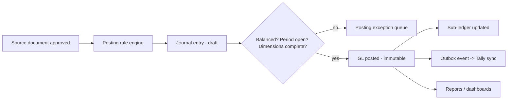
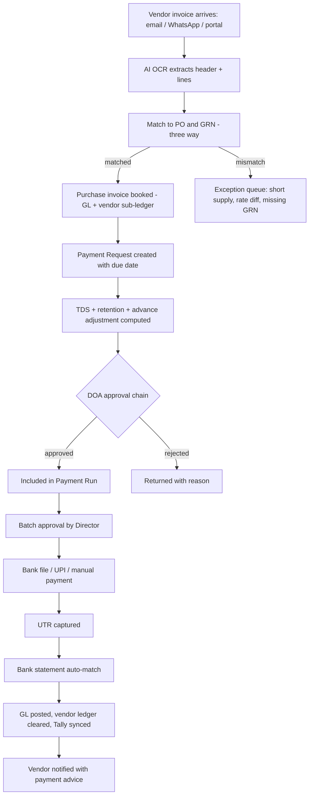
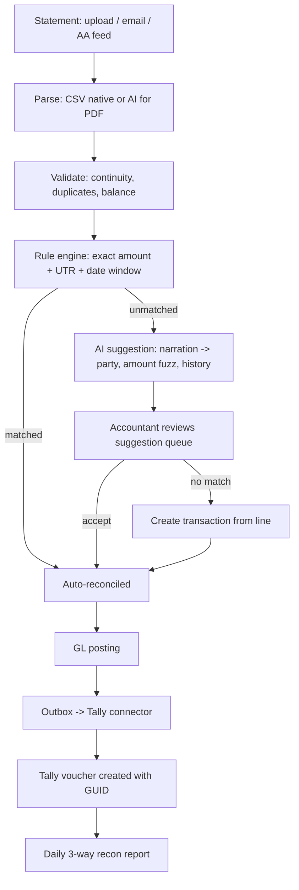
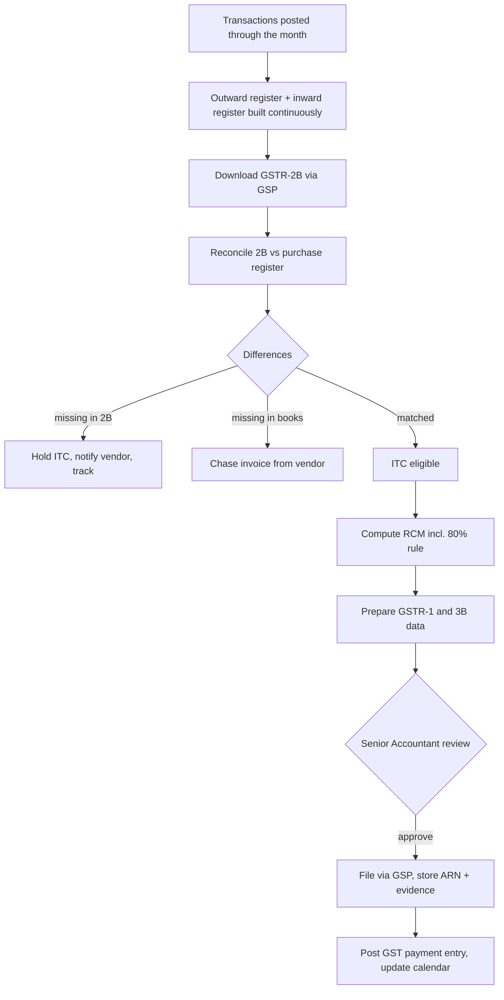
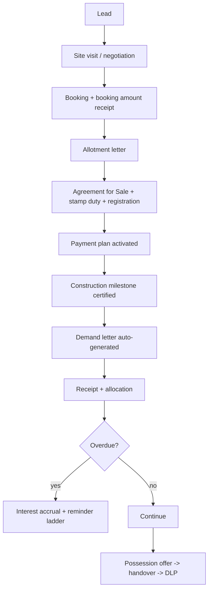

# Phase 2B — Functional Design Specification: Finance, Compliance & Legal

**Document ID:** AICOS-FDS-B · **Version:** 1.0
**Covers:** Accounts & GL · Payables & Payments · Banking, Reconciliation & Tally · Statutory (GST/TDS/RERA/ROC) · Receivables, Sales & Collections · Legal & Document Management

---

# M07 — Accounts & General Ledger

### 1. Objective
Make AI-COS the accounting master (Exec §C-2): a dimensional double-entry ledger that produces entity financials *and* project P&L from the same source, with Tally as a downstream mirror.

### 2. Functional requirements
- Chart of accounts (tree) mapped 1:1 to Tally ledger names and groups.
- Double-entry journal with dimensions: `company`, `project`, `cost_head`, `wbs_node`, `vendor/customer/member`, `boq_line`, `funding_source`.
- Auto-posting rules per transaction type (GRN, purchase invoice, payment, receipt, RA bill, member payout, salary, depreciation).
- Manual journal with attachment and approval; recurring journals; reversal journals.
- Financial periods with soft close (warn) and hard lock (block); year-end closing and opening-balance carry-forward.
- Multi-entity with inter-company transactions and elimination for consolidation.
- **FUM (funds-under-management) ledger** for self-redevelopment: society money operated by us, kept structurally outside company revenue.
- Cost-centre / project P&L, WIP and revenue recognition (percentage-of-completion for development projects; milestone-based for fee income under Ind AS 115).
- Fixed assets: capitalisation, depreciation (Companies Act SLM/WDV and Income Tax block), disposal.

### 3. Business rules
| ID | Rule |
|---|---|
| BR-GL-01 | Every journal must balance to zero by company and by currency; unbalanced entries are impossible to persist (DB constraint + application check). |
| BR-GL-02 | Every P&L line must carry a project dimension (or an explicit `COMMON` overhead project) — no orphan costs. |
| BR-GL-03 | Sub-ledgers (vendor, customer, member, stock) must tie to their control accounts daily; a break raises a blocking alert. |
| BR-GL-04 | Posting into a hard-locked period is blocked; corrections are made by reversal in an open period. |
| BR-GL-05 | Auto-generated journals cannot be edited; they are reversed and re-generated by correcting the source document. |
| BR-GL-06 | For self-redevelopment, society funds post to FUM ledgers; only our fee invoice posts to revenue (BR-015 of the BRD). |
| BR-GL-07 | Revenue recognition method is set per project and cannot change mid-year without a documented accounting-policy approval. |
| BR-GL-08 | Cash payments > ₹10,000/person/day are blocked (Sec 40A(3)); expense > ₹2,00,000 in cash blocked (Sec 269ST). |

### 4. Workflow

### 5. Database tables
`gl_account`, `journal`, `journal_line`, `posting_rule`, `financial_period`, `cost_centre`, `sub_ledger_balance`, `opening_balance`, `fum_account`, `fum_entry`, `revenue_recognition_schedule`, `fixed_asset`, `depreciation_entry`, `intercompany_transaction`, `posting_exception`.

### 6. Relationships
`journal 1—N journal_line`; `journal_line N—1 gl_account`, `N—1 project`, `N—1 cost_head`, optional `N—1 party`; `journal.source_document_type/id` polymorphic to the originating document; `fum_entry` mirrors journal structure but in a separate ledger space.

### 7. API
`POST /journals` · `POST /journals/{id}:post` · `POST /journals/{id}:reverse` · `GET /gl/trial-balance?company=&as_on=` · `GET /gl/ledger?account=&from=&to=` · `GET /projects/{id}/pnl` · `POST /periods/{id}:close` · `POST /periods/{id}:reopen` (privileged) · `GET /gl/reconciliation/control-accounts`.

### 8. UI screens
Chart of accounts tree with Tally mapping column · Journal entry screen (fast keyboard entry, dimension pickers, attachment) · Ledger viewer with running balance and drill-through to the source document · Trial balance / P&L / Balance sheet with entity+project filters and drill-down · Period-close console (checklist: unposted docs, unreconciled bank, control breaks, pending approvals) · Posting-exception queue · Fixed-asset register.

### 9. User roles
`SENIOR_ACCOUNTANT` (post, close, configure) · `JUNIOR_ACCOUNTANT` (create, cannot post above threshold / cannot close) · `AUDITOR` (read-all, immutable) · `EXECUTIVE_DIRECTOR` (read financials, approve policy changes).

### 10. Validation rules
Debit total = credit total · account must be a posting (leaf) account · date within an open period · project mandatory for P&L accounts · narration mandatory (min 10 chars) · attachment mandatory for manual journals above ₹50,000 · reversal date ≥ original date.

### 11. Reports
Trial balance (entity / project / consolidated) · P&L and Balance Sheet · Cash flow (indirect + direct) · project profitability with cost-to-complete · WIP statement · sub-ledger reconciliation · day book · fixed-asset schedule (Companies Act + IT block) · audit trail of postings · FUM statement per society.

### 12. Dashboards
Accounts dashboard: unposted documents, control-account breaks, period-close progress %, cash & bank balances, top expense heads MTD/YTD, project margin ranking.

### 13. AI opportunities
Auto-classify an expense to GL account + cost head from vendor and narration (learns from your history) · draft the month-end closing checklist status and chase owners · explain a variance in plain language ("labour cost up 22% MoM, driven by Project GKS slab cycle, 340 extra man-days") · detect misposted dimensions before close.

### 14. Security
Posting rights separated from approval rights · period reopen is a privileged, alerted action · financial statements export watermarked and logged · auditor role is read-only at the database grant level.

### 15. Future enhancements
Ind AS 115/116 automation · budgeting and forecasting module with scenario planning · segment reporting · direct XBRL output for MCA · consolidation with minority interest · continuous close.

---

# M08 — Payables, Payments & Expenses

### 1. Objective
Replace the WhatsApp approval + screenshot + Excel + Tally chain with one controlled object per payment, carrying its own approval, tax, matching and bank evidence.

### 2. Functional requirements
- **Purchase invoice booking** from GRN + vendor invoice with three-way match and tolerance.
- **Service/expense invoices** without GRN, mapped to cost heads and projects.
- **Payment Request** (from invoice, RA bill, member obligation, advance, statutory dues, petty cash replenishment).
- **Advance payments** with mandatory adjustment tracking and ageing.
- **Payment Voucher** generation with TDS, retention, debit notes and advance adjustments.
- **Payment run / batch**: group approved requests into a bank file (NEFT/RTGS/IMPS bulk format per bank) or UPI/manual.
- Petty cash / site imprest with float, expense capture on mobile with photo, and replenishment.
- Employee expense claims (basic in W2).
- Vendor ageing, payment scheduling and cash-outflow planning.
- Duplicate payment detection (exact + fuzzy) at request and again at release.

### 3. Business rules
| ID | Rule |
|---|---|
| BR-PAY-01 | Payment only against an approved obligation (invoice, RA bill, member obligation, statutory challan, approved advance request). |
| BR-PAY-02 | Three-way match: `|invoice_qty − grn_qty| ≤ tol` and `|invoice_rate − po_rate| ≤ tol`; mismatch blocks booking unless override-approved with reason. |
| BR-PAY-03 | Duplicate check on `(vendor, invoice_no, fy)` exact, plus fuzzy on `(vendor, amount ±1%, date ±7 days)` → warn and require confirmation. |
| BR-PAY-04 | Net payable = invoice − TDS − retention − advance adjusted − debit notes − recoverable material issued − penalties. |
| BR-PAY-05 | Payment cannot exceed net payable; part payment allowed, over-payment blocked. |
| BR-PAY-06 | Beneficiary bank details are taken **only** from the verified vendor master, never typed on the payment. |
| BR-PAY-07 | Payment to MSME vendors beyond 45 days triggers a Sec 43B(h) alert and is reported to the Director. |
| BR-PAY-08 | Payment run must be approved as a batch **and** each line must already carry its own approval. |
| BR-PAY-09 | A released payment cannot be edited; it is cancelled (with bank confirmation of return) and re-raised. |
| BR-PAY-10 | Advances outstanding beyond 90 days block new advances to the same vendor without Director approval. |

### 4. Workflow

### 5. Database tables
`purchase_invoice`, `purchase_invoice_line`, `invoice_match_result`, `expense_claim`, `payment_request`, `payment_request_line`, `payment_voucher`, `payment_voucher_allocation`, `payment_run`, `payment_run_line`, `advance_payment`, `advance_adjustment`, `debit_note`, `credit_note`, `retention_register`, `petty_cash_account`, `petty_cash_transaction`, `vendor_ageing_snapshot`, `duplicate_flag`.

### 6. Relationships
`purchase_invoice N—1 vendor`, `N—1 project`, lines `N—1 purchase_order_line`, `N—1 goods_receipt_line`; `payment_voucher_allocation` links a voucher to many invoices/advances (many-to-many settlement); `payment_run 1—N payment_voucher`.

### 7. API
`POST /purchase-invoices` · `POST /purchase-invoices:from-document` (AI extraction) · `GET /purchase-invoices/{id}/match` · `POST /payment-requests` · `POST /payment-requests/{id}:submit` · `GET /payment-requests/pending-approval` · `POST /payment-runs` · `POST /payment-runs/{id}:approve` · `GET /payment-runs/{id}/bank-file?format=hdfc_neft` · `POST /payment-vouchers/{id}:record-utr` · `GET /vendors/{id}/ageing` · `GET /payables/duplicates`.

### 8. UI screens
**Invoice Inbox** (email/WhatsApp/portal-fed queue; left = document viewer, right = extracted fields with confidence highlighting and click-to-source) · Match exception workbench · Payment Request form with live computation panel (gross → TDS → retention → advance → net) · **Approval card** for the Director (mobile: vendor, amount, project, budget impact, AI summary, one-tap approve) · Payment Run console (select due invoices, see cash impact, generate bank file) · Advance register with ageing · Petty cash mobile capture · Vendor ageing with drill-down.

### 9. User roles
`JUNIOR_ACCOUNTANT` (book invoices, create requests, prepare runs) · `SENIOR_ACCOUNTANT` (verify, TDS/GST correctness, release) · `EXECUTIVE_DIRECTOR` (approve per DOA) · `SITE_ENGINEER` (raise requests for site expenses, certify vendor supply) · `VENDOR` (portal: submit invoice, track status).

### 10. Validation rules
Invoice date ≤ today and within the vendor's GST validity · invoice number unique per vendor per FY · GSTIN on invoice = vendor master GSTIN (else block/flag) · HSN present for goods · taxable + tax = total (±₹1) · TDS section mandatory where applicable · bank account must be verified and past the cooling period · payment date within an open period · cash payment limits enforced.

### 11. Reports
Payable ageing (0-30/31-60/61-90/90+) · payment register (by date, project, vendor, mode) · TDS deduction register · advance outstanding and ageing · retention register with release schedule · duplicate-payment exception report · MSME payment compliance (43B(h)) · petty-cash statement per site · vendor payment history and average payment days · cash outflow by week.

### 12. Dashboards
Payables dashboard: due this week / overdue, awaiting approval by approver, invoices stuck in exception, cash required vs available, top-10 vendor exposure, duplicate alerts.

### 13. AI opportunities
Invoice OCR + line-level extraction with PO matching (biggest single time saver) · auto-classification of expense invoices to cost heads · duplicate detection across scanned and typed invoices (fuzzy, image-hash) · payment prioritisation suggestion under cash constraint (which 20 of 60 invoices to pay, weighted by MSME risk, vendor criticality, discount terms) · payment-advice drafting · anomaly detection (new bank account + urgent request = fraud pattern alert).

### 14. Security
Highest-risk module: mandatory MFA for approve/release · beneficiary changes alerted to the Director in real time · segregation between preparer, approver and releaser (SoD exception if collapsed) · bank file downloads logged, checksummed and single-use · no payment API can be called by an AI agent — agents may only draft.

### 15. Future enhancements
Direct bank H2H / corporate API payment initiation with maker-checker at the bank · dynamic discounting for early payment · virtual accounts per vendor for automatic reconciliation · supply-chain finance integration · automated Form 26AS/AIS cross-check.

---

# M09 — Banking, Reconciliation & Tally Integration

### 1. Objective
Kill the "download PDF → WhatsApp → re-key into Tally → reconcile later" cycle entirely, and keep Tally correct without anyone typing into it.

### 2. Functional requirements
- Bank account master per company/project (incl. RERA designated 70% account and its 30% counterpart).
- **Statement ingestion**: CSV/XLS/MT940/PDF upload, scheduled email fetch, and (later) Account Aggregator pull.
- AI parsing of PDF statements into normalised lines (date, narration, ref, debit, credit, balance) with balance-continuity validation.
- **Reconciliation engine**: rule-based match (amount + UTR/cheque ref + date window) → AI-assisted match (narration → vendor/member/customer) → manual match; many-to-one and one-to-many matching; part matches.
- Unmatched-line workbench with "create transaction from this line" (expense, receipt, transfer, charge, interest).
- Bank charges/interest auto-posting rules.
- **Tally connector**: one-way AI-COS → Tally push of vouchers and masters, with idempotency, retry, and a daily three-way reconciliation report (AI-COS GL ↔ Tally ↔ Bank).
- Cheque register, PDC tracking, stop-payment.
- Cash flow position across all accounts, real time.

### 3. Business rules
| ID | Rule |
|---|---|
| BR-BNK-01 | A statement line is immutable once ingested; corrections happen via matching, never by editing the line. |
| BR-BNK-02 | Closing balance of statement N must equal opening balance of statement N+1, else ingestion is rejected as a gap. |
| BR-BNK-03 | Auto-match posts only when confidence ≥ 0.95 **and** amount matches exactly **and** a reference (UTR/cheque) matches; everything else is a *suggestion* requiring one click. |
| BR-BNK-04 | A statement line may be matched to multiple vouchers (bulk transfer) and vice versa; total must tie exactly. |
| BR-BNK-05 | Tally sync is one-way; if a Tally-side edit is detected, the sync report flags it and the Tally value is treated as drift to be corrected, not adopted. |
| BR-BNK-06 | Each voucher pushed to Tally carries a durable `aicos_guid`; re-push updates rather than duplicates. |
| BR-BNK-07 | Bank reconciliation must be complete before a period can be hard-locked. |
| BR-BNK-08 | RERA designated account withdrawals require the certification set (Form 1/2/3) to be on file for the claimed percentage. |

### 4. Workflow

### 5. Database tables
`bank_account`, `bank_statement`, `bank_statement_line`, `reconciliation_match`, `reconciliation_rule`, `bank_charge_rule`, `cheque_register`, `pdc`, `tally_sync_queue`, `tally_sync_log`, `tally_ledger_map`, `tally_drift_report`, `cash_position_snapshot`.

### 6. Relationships
`bank_statement 1—N bank_statement_line`; `reconciliation_match` N—M between `bank_statement_line` and `journal`/`payment_voucher`/`receipt`; `tally_sync_queue` references `journal`.

### 7. API
`POST /bank-accounts/{id}/statements:upload` · `GET /bank-statements/{id}/lines?status=unmatched` · `POST /reconciliation:auto-run` · `GET /reconciliation/suggestions?line_id=` · `POST /reconciliation/matches` · `DELETE /reconciliation/matches/{id}` · `POST /bank-statement-lines/{id}:create-transaction` · `GET /tally/sync-status` · `POST /tally/sync:retry` · `GET /tally/drift-report` · `GET /treasury/cash-position`.

### 8. UI screens
**Reconciliation workbench** — the accountant's main screen: left = statement lines, right = candidate vouchers, centre = match action; keyboard-driven; colour-coded confidence; "match all high-confidence" bulk button · Statement upload with parse preview · Unmatched ageing view · Tally sync monitor (queued / synced / failed with error text and retry) · Three-way reconciliation report · Cash position across accounts · Cheque and PDC registers.

### 9. User roles
`JUNIOR_ACCOUNTANT` (match, create from line) · `SENIOR_ACCOUNTANT` (approve unusual matches, resolve drift, lock) · `EXECUTIVE_DIRECTOR` (cash position view) · `AUDITOR` (read).

### 10. Validation rules
Statement date range cannot overlap an existing statement for the same account · debit XOR credit per line · balance continuity within ₹1 · match total must equal line amount · cannot match a line to a voucher of a different bank account · cannot unmatch after period lock.

### 11. Reports
Bank reconciliation statement (BRS) per account per period · unmatched ageing · auto-match rate (a key product KPI) · Tally sync exception · three-way recon (AI-COS vs Tally vs bank) · bank charges analysis · daily cash position and 13-week forecast · cheque outstanding.

### 12. Dashboards
Treasury: balances by account, today's inflow/outflow, unreconciled count and ageing, sync health, forecast runway.

### 13. AI opportunities
PDF statement parsing across bank formats without per-bank templates · narration → party resolution ("NEFT-SHREE STEEL TRD-HDFC0000123-XXXX" → vendor #482) · learning matcher that improves from every accepted/rejected suggestion (feedback loop stored and used) · classification of unmatched debits into expense heads · detection of unusual bank activity (round-figure transfers to unknown beneficiaries, weekend high-value debits).

### 14. Security
Bank statement files encrypted at rest with restricted access · connector runs with least-privilege credentials on a controlled Windows host, outbound-only, mTLS to the platform · no inbound port opened at the client site · Tally credentials stored in the vault, never in the connector config file · full log of every voucher pushed.

### 15. Future enhancements
Account Aggregator (Sahamati) live feeds · direct corporate banking APIs · positive-pay integration · virtual accounts for member/customer collections (auto-identification) · automatic FD/sweep management · replacing Tally entirely (decision point at end of Wave 3).

---

# M10 — Statutory Compliance (GST · TDS · RERA · ROC · Labour)

### 1. Objective
Convert the Senior Accountant's expertise into enforced system rules, so compliance is a by-product of transactions rather than a month-end scramble. (Rule tables live in [`12-india-compliance-rules.md`](12-india-compliance-rules.md).)

### 2. Functional requirements
**GST:** GSTIN-wise registration, outward supply register, inward supply and ITC register with eligibility flags, **RCM computation including the 80% procurement rule for real-estate promoters**, e-invoice (IRN/QR) and e-way bill via GSP, GSTR-1/3B data preparation, GSTR-2B download and reconciliation with purchase register, ITC reversal (Rule 42/43), annual return support.
**TDS/TCS:** section master with rates/thresholds, deductee-wise ledger, lower/nil deduction certificates with limit tracking, challan (ITNS 281) generation and payment tracking, Form 26Q/27Q/27EQ data export, Form 16A issuance, interest on late deduction/payment, 194Q vs 206C(1H) interplay.
**RERA:** project registration data, agreement register, **70:30 designated account tracking**, withdrawal certification workflow (Form 1 architect / Form 2 engineer / Form 3 CA), quarterly progress report (QPR) pack generation, extension and amendment tracking.
**ROC/MCA:** director and DIN register, DSC expiry, board & shareholder resolutions, statutory registers, annual filing calendar (AOC-4, MGT-7, DIR-3 KYC).
**Labour:** PF/ESIC applicability for contract labour, BOCW cess 1% computation and remittance, contractor labour licence validity, minimum-wage compliance check, muster and wage register formats.
**Compliance calendar:** every obligation with owner, due date, dependency, reminder ladder, and evidence of filing.

### 3. Business rules (extract; full set in Phase 12)
| ID | Rule |
|---|---|
| BR-CMP-01 | ITC is claimable only if the invoice appears in GSTR-2B, the vendor GSTIN is active, payment is made within 180 days, and the item is not blocked u/s 17(5) — all four are checked and the ITC is held until satisfied. |
| BR-CMP-02 | Works-contract input for immovable property is generally blocked ITC u/s 17(5); the system defaults such lines to ineligible and requires justification to override. |
| BR-CMP-03 | Promoters under the 1%/5% scheme must procure ≥ 80% of inputs from registered suppliers; the shortfall attracts RCM at 18% — tracked continuously and computed at year end. |
| BR-CMP-04 | TDS is computed at the earlier of credit or payment; thresholds are evaluated cumulatively per deductee per FY per section. |
| BR-CMP-05 | An LDC reduces the rate only up to its certified limit and within its validity; consumption is tracked and the rate reverts automatically on exhaustion. |
| BR-CMP-06 | 194Q (buyer, 0.1% above ₹50L purchases) takes precedence over 206C(1H) where both apply. |
| BR-CMP-07 | RERA designated account: 70% of every receipt from allottees must be deposited into it; withdrawals may not exceed the certified percentage of completion. |
| BR-CMP-08 | QPR is due within the state-prescribed window after each quarter end; the system blocks quarter close until the pack is generated. |
| BR-CMP-09 | Every compliance obligation must have a named owner; unowned obligations escalate to the Senior Accountant, then the Director. |
| BR-CMP-10 | Statutory rates are configuration with effective dates — never hard-coded (A-01). |

### 4. Workflow — GST monthly cycle

### 5. Database tables
`gst_registration`, `gst_outward_register`, `gst_inward_register`, `itc_ledger`, `gstr2b_import`, `gstr2b_line`, `gst_reconciliation_result`, `rcm_liability`, `einvoice_log`, `eway_bill`, `gst_return_filing`, `tds_section`, `tds_deduction`, `tds_challan`, `tds_return_filing`, `ldc_certificate`, `ldc_consumption`, `rera_project`, `rera_designated_account_txn`, `rera_certification`, `rera_qpr`, `statutory_register`, `board_resolution`, `compliance_obligation`, `compliance_event`, `labour_compliance_record`.

### 6. Relationships
`gst_inward_register N—1 purchase_invoice`; `itc_ledger` tied to invoice + 2B match state; `tds_deduction N—1 payment_voucher`, `N—1 tds_section`, optional `N—1 ldc_certificate`; `rera_designated_account_txn N—1 bank_statement_line`; `compliance_obligation 1—N compliance_event`.

### 7. API
`GET /gst/registers?gstin=&period=` · `POST /gst/gstr2b:import` · `GET /gst/reconciliation?period=` · `POST /gst/einvoice` · `GET /gst/rcm-liability?fy=` · `GET /tds/computation?voucher=` · `POST /tds/challans` · `GET /tds/form-26q-data?quarter=` · `POST /ldc-certificates` · `GET /rera/{project}/designated-account` · `POST /rera/{project}/qpr:generate` · `GET /compliance/calendar?month=`.

### 8. UI screens
Compliance calendar (month grid + list, RAG by due date, owner avatars, evidence upload) · GST workbench (registers, 2B recon with 3 buckets, ITC held, RCM tracker with an 80%-rule gauge) · TDS workbench (deduction register, threshold tracker per deductee, challan generation, return data preview) · LDC register with consumption bar · RERA console (designated account balance, % complete certified vs withdrawn, QPR builder) · Statutory register & DSC expiry board.

### 9. User roles
`SENIOR_ACCOUNTANT` (owner) · `JUNIOR_ACCOUNTANT` (prepare) · `EXECUTIVE_DIRECTOR` (visibility, sign-off) · `AUDITOR` (read) · `CONSULTANT_CA` (scoped external access, optional).

### 10. Validation rules
GSTIN state code must match the place of supply logic · HSN/SAC mandatory · e-invoice required above the applicable turnover threshold — block invoice issue without IRN where applicable · TDS rate ∈ section master for the document date · challan BSR + serial format · RERA registration number format per state · QPR quarter must be closed before generation.

### 11. Reports
GSTR-1 / 3B working papers · ITC register with eligibility reasons · 2B reconciliation (matched / in-2B-not-in-books / in-books-not-in-2B) with vendor-wise chase list · RCM liability statement incl. 80% computation · TDS deduction and payment register, section-wise · Form 26Q data file · TDS interest exposure · RERA designated-account statement and withdrawal certificate pack · compliance calendar status and misses · statutory register extract.

### 12. Dashboards
Compliance health: obligations due in 7/30 days, overdue count, ITC at risk (₹), RCM exposure, TDS payable, RERA withdrawal headroom, DSC/licence expiries.

### 13. AI opportunities
Read GSTR-2B JSON and reconcile with fuzzy invoice-number matching (a genuinely hard manual task) · draft vendor chase emails/WhatsApp for missing invoices · classify ITC eligibility with a cited reason under Sec 17(5) · read an LDC PDF into structured limits · assemble the RERA QPR narrative from DPR and progress data · monitor rate-change notifications and propose configuration updates for human approval (never auto-apply).

### 14. Security
Statutory credentials (GSP tokens, portal logins) in the vault with rotation · filing actions require MFA · evidence documents are legal-hold protected · no AI agent may file a return; it may only prepare.

### 15. Future enhancements
Direct GSTN and TRACES automation · AIS/26AS reconciliation · litigation and notice tracker with hearing calendar · state-wise labour-law rule packs · automated income-tax computation and advance-tax scheduling · e-sign of statutory forms.

---

# M11 — Receivables, Flat Sales & Collections

### 1. Objective
Manage the free-sale inventory, the sale lifecycle, and the money that must come in — with demand letters, receipts, ageing and interest handled by the system rather than a register.

### 2. Functional requirements
- Unit inventory: tower/wing/floor/unit, carpet/built-up/saleable area, type, facing, view premium, status (available / blocked / booked / agreement / registered / possession).
- Price master with base rate, floor rise, PLC, parking, clubhouse, and other charges; discount approval workflow.
- Booking → allotment letter → agreement for sale → registration → possession, with milestone-linked payment plan (construction-linked or time-linked).
- **Demand letter generation** on milestone achievement (auto-triggered by certified progress), with GST and TDS 194-IA handling.
- Receipts (cheque/NEFT/UPI/gateway) with allocation across principal, GST, interest, other charges.
- Interest on delayed payment per the agreement clause; waiver with approval.
- Customer ledger, outstanding ageing, and collection follow-up tasks.
- Broker/channel-partner commission (we are not brokers, but we may pay them) with TDS 194-H.
- Cancellation and refund workflow with deduction rules.

### 3. Business rules
| ID | Rule |
|---|---|
| BR-SAL-01 | A unit can be booked by only one customer at a time; blocking has a configurable expiry (default 7 days) after which it auto-releases. |
| BR-SAL-02 | Sale price below the approved floor price requires a discount approval; the approved value is frozen on the booking. |
| BR-SAL-03 | Demand is raised only when the linked construction milestone is certified in the system — not by manual claim. |
| BR-SAL-04 | Buyer must deduct TDS u/s 194-IA (1%) where consideration ≥ ₹50 lakh; the demand letter states net payable and TDS separately, and credit is tracked. |
| BR-SAL-05 | Receipts allocate in the configured order (interest → other charges → GST → principal) unless overridden with approval. |
| BR-SAL-06 | For RERA projects, 70% of every allottee receipt is transferred to the designated account, tracked per receipt. |
| BR-SAL-07 | Possession cannot be offered while dues are outstanding, unless waived by the Director with reason. |
| BR-SAL-08 | Cancellation refund = received − deduction per agreement − GST reversal impact; requires Director approval. |

### 4. Workflow

### 5. Database tables
`unit`, `unit_price`, `unit_status_history`, `lead`, `lead_activity`, `customer`, `booking`, `booking_charge`, `payment_plan`, `payment_plan_milestone`, `demand_letter`, `demand_line`, `receipt`, `receipt_allocation`, `interest_accrual`, `sale_agreement`, `cancellation`, `broker`, `broker_commission`, `possession_offer`.

### 6. Relationships
`project 1—N unit`; `unit 1—1 active booking`; `booking 1—N demand_letter 1—N receipt_allocation`; `payment_plan_milestone N—1 project_milestone` (drives auto-demand); `receipt N—1 bank_statement_line` after reconciliation.

### 7. API
`GET /projects/{id}/inventory` · `POST /bookings` · `POST /bookings/{id}/discount-approval` · `POST /projects/{id}/demands:generate?milestone=` · `GET /customers/{id}/ledger` · `POST /receipts` · `POST /receipts/{id}/allocate` · `GET /receivables/ageing` · `POST /bookings/{id}:cancel`.

### 8. UI screens
Inventory grid (tower × floor visual with colour-coded status, click to book) · Cost sheet generator with live computation and discount request · Booking form with document checklist · Payment plan viewer with milestone status · Demand letter batch generator with preview and merge-print · Receipt entry with allocation preview · Customer 360 (ledger, documents, communications, dues) · Collection follow-up board (kanban by ageing bucket).

### 9. User roles
`SALES_EXECUTIVE` (leads, bookings) · `SALES_MANAGER` (discounts, inventory release) · `ACCOUNTS` (receipts, demands, ledger) · `EXECUTIVE_DIRECTOR` (price approval, cancellation) · `CUSTOMER` (portal: ledger, demands, receipts, documents).

### 10. Validation rules
Unit must be available at booking · sale value ≥ floor price or approval exists · agreement date ≥ booking date · receipt amount > 0 and ≤ outstanding + advance tolerance · TDS certificate details required for 194-IA credit · stamp duty and registration fields mandatory before registration status · possession blocked with dues.

### 11. Reports
Inventory status and absorption · booking register · collection register and ageing · demand vs collection · interest accrued and waived · unit-wise realisation vs base price · broker commission with TDS · cancellation register · RERA 70% deposit compliance per receipt.

### 12. Dashboards
Sales dashboard: units sold/available, value booked vs target, collection efficiency %, overdue ₹, this month's demands, upcoming registrations.

### 13. AI opportunities
Auto-generate the cost sheet and agreement draft from the booking · read a customer's payment UTR message and match it to a demand · predict collection likelihood and prioritise follow-ups · lead scoring from CRM activity · draft multilingual reminder messages · extract TDS 194-IA credit details from Form 16B PDFs.

### 14. Security
Customer PII and financial data restricted · discount approvals immutable · portal access scoped to the customer's own bookings · price lists confidential.

### 15. Future enhancements
Payment gateway and UPI auto-collect with virtual accounts · digital agreement e-sign and e-stamping · channel-partner portal · dynamic pricing engine · possession and snag app for customers.

---

# M12 — Legal, Contracts & Document Management

### 1. Objective
Give every document a home, a version, an owner, an expiry and a link to the transaction it belongs to — replacing Google Drive folders and WhatsApp forwards.

### 2. Functional requirements
- Central repository with folder taxonomy per project/entity and mandatory linkage to an entity (project, vendor, member, transaction).
- Versioning, check-in/check-out, watermarking, and access control at folder and document level.
- OCR + full-text + semantic search across all documents.
- Document types with metadata schemas (agreement, licence, approval, certificate, drawing, photo, invoice, statement).
- **Contract lifecycle**: draft → internal review → counterparty review → execution (e-sign/physical) → registration → obligations & milestones → renewal/expiry alerts.
- Legal matter tracker: notices, disputes, hearings, advocates, costs.
- Statutory approvals register (IOD, CC, plinth, OC, environment, fire, tree, drainage) with validity and renewal.
- Drawing register with revision control and "latest for construction" flag.
- Template library with merge fields for generated documents.
- Retention policy and legal hold.

### 3. Business rules
| ID | Rule |
|---|---|
| BR-DOC-01 | Every document must be linked to at least one entity; unlinked uploads go to a quarantine inbox for classification. |
| BR-DOC-02 | A document referenced by an approved transaction cannot be deleted or replaced — only superseded by a new version. |
| BR-DOC-03 | Expiring documents (licence, insurance, LDC, DSC, bank guarantee) alert at T-60, T-30, T-7 days to the named owner. |
| BR-DOC-04 | Only the latest approved drawing revision is marked "for construction"; superseded revisions are watermarked. |
| BR-DOC-05 | Bank guarantees are tracked with claim-period expiry and must be extended or released explicitly. |
| BR-DOC-06 | Legal hold overrides retention deletion. |

### 4. Workflow
Upload / email-in / mobile capture → AI classification & metadata extraction → link to entity → (optional) approval → indexed & searchable → version updates → expiry monitoring → archive/retention.

### 5. Database tables
`document`, `document_version`, `document_type`, `document_link`, `document_access`, `document_tag`, `folder`, `contract`, `contract_obligation`, `contract_milestone`, `legal_matter`, `legal_event`, `statutory_approval`, `drawing`, `drawing_revision`, `bank_guarantee`, `template`, `retention_policy`, `legal_hold`, `document_extraction` (AI output with confidence).

### 6. Relationships
`document 1—N document_version`; `document_link` polymorphic (document ↔ project/vendor/member/transaction, many-to-many); `contract 1—N contract_obligation`; `drawing 1—N drawing_revision`.

### 7. API
`POST /documents` (multipart, presigned) · `GET /documents:search?q=&semantic=true` · `POST /documents/{id}/versions` · `POST /documents/{id}/links` · `GET /documents/{id}/download` (signed, logged) · `POST /documents:classify` (AI) · `GET /contracts/{id}/obligations` · `GET /expiring?days=30` · `POST /templates/{id}:render`.

### 8. UI screens
Document explorer (tree + grid + preview pane) · Universal search bar with natural-language query and filters · Upload/drag-drop with AI-suggested classification · Version history diff · Contract workspace (clauses, obligations, milestones, renewals) · Expiry board · Drawing register with revision compare · Template editor.

### 9. User roles
`DOCUMENT_CONTROLLER` · `SENIOR_ACCOUNTANT` (legal/statutory) · `SITE_ENGINEER` (drawings, site docs) · `AUDITOR` (read) · all roles read within their scope.

### 10. Validation rules
Max file size 100 MB (configurable), allowed MIME types, virus scan mandatory before availability · metadata required per document type · expiry date mandatory for expiring types · drawing revision number must increment.

### 11. Reports
Document inventory by project/type · missing mandatory documents per project (a genuine audit-readiness report) · expiring documents · contract obligation status · legal matter status and cost · drawing revision register · access log per document.

### 12. Dashboards
Compliance-document health per project: % mandatory documents present, expiries in 30 days, unclassified inbox count.

### 13. AI opportunities
Auto-classify and extract metadata on upload (party, date, value, expiry) · semantic search ("find the clause about rent escalation in the GKS development agreement") · clause extraction and risk flagging against a standard playbook · obligation extraction into a tracked schedule (turns a PDF contract into calendar items) · summarise a 90-page development agreement into a one-page brief for the Director · redaction of PII for external sharing.

### 14. Security
Encrypted storage with per-tenant keys · signed, expiring download URLs · watermarking with viewer identity for sensitive documents · full download/print audit · DRM-style restrictions for external portal viewers · virus scanning · legal hold immutability (S3 Object Lock).

### 15. Future enhancements
Aadhaar/DSC e-sign workflows · negotiation redlining with counterparties · AI contract drafting from a clause library · integration with sub-registrar e-registration · blockchain-anchored document hashes for evidentiary value.
