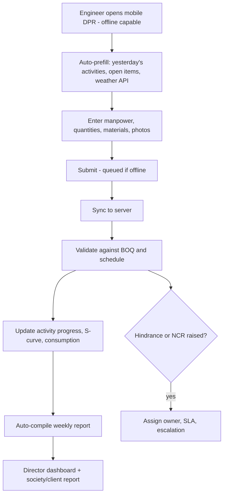
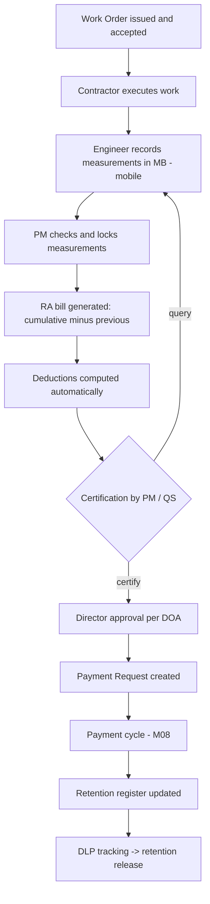
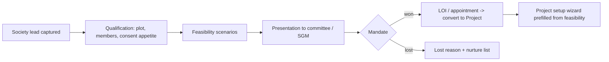
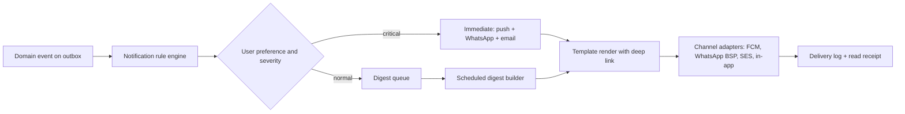

# Phase 2C — Functional Design Specification: Site, Contractors, People, CRM & Insight

**Document ID:** AICOS-FDS-C · **Version:** 1.0
**Covers:** Site Execution & DPR · Contractor & RA Bill Certification · Labour · HR & Payroll · CRM & Lead · Feasibility · Reporting, Dashboards & Notifications · Administration

---

# M13 — Site Execution & Daily Progress

### 1. Objective
Turn the WhatsApp site group into structured, measurable, photo-evidenced progress data that drives schedule, cost, billing and client reporting.

### 2. Functional requirements
- **DPR (Daily Progress Report)**: date, shift, weather, manpower by trade (own + each contractor), equipment deployed, activities executed with quantity against BOQ/WBS, materials consumed, visitors, safety observations, hindrances/delays with cause codes, photos with geo/time watermark, engineer's remarks.
- Weekly and monthly progress reports auto-compiled from DPRs.
- Activity progress update feeding the schedule and S-curve.
- Quality: checklists per activity (pre-pour, reinforcement, shuttering), NCR raise/assign/close with photos, test results register (cube tests, steel tests) with pass/fail and lab reference.
- Safety: incident register, near-miss, toolbox talks, PPE compliance, work-permit system (hot work, height, confined space).
- Hindrance/delay register with responsibility attribution (client, contractor, us, force majeure, weather) — the basis for EOT claims.
- Site instruction register and consultant/client visit notes.
- **Offline-first mobile capture** with queued sync (Exec §C-7).

### 3. Business rules
| ID | Rule |
|---|---|
| BR-SIT-01 | DPR is due by 20:00 daily per project; a missing DPR escalates to the PM at 21:00 and the Director next morning. |
| BR-SIT-02 | Progress quantity for an activity cannot exceed the BOQ quantity for that line without an approved variation. |
| BR-SIT-03 | Cumulative progress can never decrease; corrections are made as a negative adjustment entry with reason, retaining history. |
| BR-SIT-04 | Photos must carry device timestamp and GPS; images without them are accepted but flagged as unverified. |
| BR-SIT-05 | An open critical NCR blocks certification of the affected activity in RA billing. |
| BR-SIT-06 | A failed material/cube test blocks acceptance of the related work and raises a mandatory NCR. |
| BR-SIT-07 | Manpower reported in the DPR must reconcile with the contractor muster within ±10%, else flagged. |
| BR-SIT-08 | Offline records sync with the device's capture timestamp preserved; the server records both capture and sync time. |

### 4. Workflow

### 5. Database tables
`dpr`, `dpr_manpower`, `dpr_equipment`, `dpr_activity_progress`, `dpr_material_consumption`, `dpr_photo`, `hindrance`, `ncr`, `ncr_action`, `quality_checklist`, `quality_checklist_item`, `quality_test`, `safety_incident`, `toolbox_talk`, `work_permit`, `site_instruction`, `site_visit`, `weather_log`.

### 6. Relationships
`dpr N—1 project`, `1—N dpr_activity_progress N—1 activity/boq_line`; `dpr_photo N—1 document`; `ncr N—1 activity`, `N—1 vendor` (contractor); `hindrance` feeds EOT analysis on `activity`.

### 7. API
`POST /dpr` (idempotent, `client_generated_id` for offline) · `GET /dpr?project=&date=` · `POST /dpr/{id}/photos` (presigned S3) · `POST /sync/batch` (offline queue drain) · `POST /ncrs` · `POST /ncrs/{id}:close` · `POST /quality-tests` · `GET /projects/{id}/progress-summary?from=&to=`.

### 8. UI screens
**Mobile DPR** — single scrolling form, big touch targets, works on 3G, autosaves, shows sync state per section · Photo capture with automatic watermark · DPR web view for the PM with approve/comment · Progress board (activity × planned vs actual) · NCR/snag kanban · Quality checklist runner (tick-list with photo per item) · Weekly report preview and send · Hindrance register with responsibility pie.

### 9. User roles
`SITE_ENGINEER` (create) · `PROJECT_MANAGER` (review/approve) · `QC_ENGINEER` (quality/NCR) · `SAFETY_OFFICER` (safety) · `EXECUTIVE_DIRECTOR` (read, exception feed) · `SOCIETY_COMMITTEE` (curated progress view).

### 10. Validation rules
One DPR per project per date per shift · manpower ≥ 0 and ≤ configured site capacity (warn) · quantity ≤ remaining BOQ quantity · at least 3 photos required (configurable) · date not in the future · NCR must have a due date and owner.

### 11. Reports
DPR register and compliance % · weekly/monthly progress report (client/society format) · planned vs actual S-curve · manpower histogram and productivity (output per man-day) · hindrance/delay analysis with responsibility split · NCR ageing and closure rate · quality test register with failure trend · safety statistics (LTIFR, near-miss count).

### 12. Dashboards
Site dashboard: today's DPR submitted?, manpower trend 30 days, activities behind schedule, open NCRs, material due-in, safety days-without-incident.

### 13. AI opportunities
Photo → progress estimation (which floor slab, % complete) as an assistive signal · auto-draft the DPR narrative from structured entries · voice-to-DPR in Hindi/Marathi for engineers on site (high adoption value) · delay prediction from productivity trend, manpower and weather · automatic weekly report generation in the society's language · detect a mismatch between reported progress and photographic evidence.

### 14. Security
Photos carry immutable EXIF plus server-side hash · DPR is append-only after approval (amendments are new versions) · society/client portal sees a curated view, never internal cost data · offline device data encrypted at rest, wiped on logout.

### 15. Future enhancements
Drone flights with photogrammetric volume/progress computation · 360° walkthrough capture linked to BIM · IoT sensors (concrete maturity, crane hours) · AI safety-violation detection from CCTV (PPE, exclusion zones) · automatic EOT claim pack generation.

---

# M14 — Contractor Management & RA Bill Certification

### 1. Objective
Certify contractor bills from measured work, with every deduction computed by the system — removing the largest source of disputes and leakage in construction.

### 2. Functional requirements
- Contractor master extension: trade, licence, PF/ESIC codes, labour licence, insurance (WC policy), agreement terms.
- **Work Order** with rate schedule (item-rate / lump-sum / cost-plus), retention %, mobilisation advance %, recovery schedule, penalty/LD clause, escalation clause, DLP period.
- **Measurement Book (MB)**: measurement entries with dimensions (L×B×H×nos), reference to drawing and location, recorded by engineer, checked by PM.
- **RA (Running Account) bill**: cumulative measured quantity → this-bill quantity → gross value → deductions → net payable, with previous-bill carry-forward.
- Deductions: retention, mobilisation advance recovery, material issued (recoverable), water/electricity charges, penalty/LD, TDS, GST TDS (if applicable), other recoveries.
- Variation orders / extra items with rate approval before execution.
- Final bill with no-claim certificate, retention release schedule tied to DLP.
- Contractor performance scorecard (quality, schedule, safety, labour compliance).
- Bank guarantee tracking (performance BG, advance BG) with expiry alerts.

### 3. Business rules
| ID | Rule |
|---|---|
| BR-RAB-01 | Cumulative certified quantity for a WO item can never exceed WO quantity + approved variation. |
| BR-RAB-02 | This-bill quantity = cumulative measured − previously certified; negative values require an approved rectification bill. |
| BR-RAB-03 | Retention accrues on gross value at the WO rate and is released only per the release schedule (default 50% at virtual completion, 50% at DLP end). |
| BR-RAB-04 | Mobilisation advance is recovered pro-rata (default: proportion of work billed) and must be fully recovered before the final bill. |
| BR-RAB-05 | Material issued to the contractor is auto-deducted at the issue value; the recovery register must tie to the store's issue records. |
| BR-RAB-06 | Every RA bill line must have measurement records; a bill without MB entries is blocked. |
| BR-RAB-07 | LD/penalty is computed from the WO's delay clause using certified milestone dates; waiver requires Director approval with reason. |
| BR-RAB-08 | Extra items executed without a prior approved rate are certified provisionally at 0 value until rate approval. |
| BR-RAB-09 | Final bill requires: all NCRs closed, labour compliance evidence, BG status resolved, no-claim certificate. |
| BR-RAB-10 | Payment against an RA bill follows the same DOA and three-way-equivalent controls as vendor invoices. |

### 4. Workflow

### 5. Database tables
`work_order`, `work_order_line`, `work_order_term`, `variation_order`, `variation_order_line`, `measurement_book`, `measurement_entry`, `ra_bill`, `ra_bill_line`, `ra_bill_deduction`, `retention_ledger`, `mobilisation_advance`, `advance_recovery`, `contractor_scorecard`, `bank_guarantee`, `final_bill`, `dlp_record`.

### 6. Relationships
`work_order N—1 vendor`, `N—1 project`; `measurement_entry N—1 work_order_line`; `ra_bill 1—N ra_bill_line N—1 work_order_line`; `ra_bill 1—N ra_bill_deduction`; `retention_ledger N—1 ra_bill`; `ra_bill 1—1 payment_request`.

### 7. API
`POST /work-orders` · `POST /work-orders/{id}/variations` · `POST /measurements` (mobile, offline-capable) · `POST /measurement-books/{id}:lock` · `POST /ra-bills:generate?wo=&upto=` · `GET /ra-bills/{id}/computation` · `POST /ra-bills/{id}:certify` · `GET /contractors/{id}/retention` · `POST /retention:release` · `GET /contractors/{id}/scorecard`.

### 8. UI screens
Work Order editor with rate schedule import · **Measurement entry (mobile)**: pick WO item → enter nos/L/B/H → auto-compute quantity → attach sketch/photo · MB viewer with running totals per item · **RA bill computation sheet** — the key screen: item-wise cumulative/previous/this-bill, then a deduction stack with each line explained and drill-through · Certification screen with checklist (NCRs closed? measurements locked? labour compliance?) · Retention register with release schedule calendar · Contractor 360 with scorecard.

### 9. User roles
`SITE_ENGINEER` (measurements) · `QS` (bill preparation) · `PROJECT_MANAGER` (certify) · `EXECUTIVE_DIRECTOR` (approve) · `ACCOUNTS` (payment, TDS) · `CONTRACTOR` (portal: view WO, bill status, payment status).

### 10. Validation rules
Measurement dimensions > 0 · quantity computation formula validated per UOM (m³ requires L,B,H; m² requires L,B) · cumulative ≤ WO + variations · deduction percentages within the WO terms · bill period cannot overlap a previous bill · certification requires all mandatory checklist items.

### 11. Reports
RA bill register and status · WO vs certified vs paid · retention outstanding and release forecast · advance recovery status · variation order register with cost impact · contractor performance ranking · measurement abstract per WO · labour compliance status per contractor · BG expiry report.

### 12. Dashboards
Contractor dashboard: bills awaiting certification, value certified MTD, retention held, advances outstanding, contractors with compliance gaps, LD exposure.

### 13. AI opportunities
Read a contractor's submitted bill PDF/Excel and map it to WO items for comparison against our own measurements (catches inflated claims) · detect measurement anomalies (a beam measured twice, dimensions inconsistent with drawings) · suggest LD applicability from the schedule · summarise a bill's variance vs the previous bill for the certifier · extract rates from a signed WO PDF during migration.

### 14. Security
Measurement locking prevents retrospective inflation · certification is a named, MFA-protected action · contractor portal shows only its own data · all rate and deduction overrides logged with reason and reported.

### 15. Future enhancements
Digital signature on MB and certificates · 3D/BIM-based quantity verification · contractor mobile app for bill submission and progress claim · automatic labour-compliance verification from PF/ESIC portals · arbitration/claim pack assembly.

---

# M15 — Labour Management

### 1. Objective
Track who is on site, what they cost, whether they are legally engaged, and whether the labour deployed matches the work certified.

### 2. Functional requirements
- Labour master: own workforce and contractor labour; trade, skill category, wage rate, ID (Aadhaar masked), bank/UPI, BOCW registration, induction & safety training record.
- Attendance/muster: daily in/out, gang-wise, trade-wise; mobile capture; optional biometric/face-recognition device integration; overtime.
- Wage computation for own labour (daily/weekly), advances and deductions, wage register in statutory format.
- Contractor labour: headcount reconciliation with DPR and RA bill, PF/ESIC compliance evidence collection, minimum wage verification.
- Labour productivity: man-days per activity vs norm.
- BOCW cess computation (1% of construction cost) and remittance tracking.
- Labour welfare: accommodation, drinking water, first aid, crèche compliance checklist (statutory site requirements).

### 3. Business rules
| ID | Rule |
|---|---|
| BR-LAB-01 | Wage rate must be ≥ the applicable state minimum wage for the trade and skill category; violations are blocked. |
| BR-LAB-02 | A labourer cannot be marked present at two projects on the same date. |
| BR-LAB-03 | Contractor labour without PF/ESIC evidence for the month raises a compliance hold on that contractor's RA bill payment (warn, escalate). |
| BR-LAB-04 | Cash wage payment above ₹10,000 per person per day is blocked (Sec 40A(3)). |
| BR-LAB-05 | Man-days recorded must reconcile with DPR manpower within ±10%. |
| BR-LAB-06 | BOCW cess accrues on qualifying construction cost as it is incurred and must be remitted within the statutory period. |

### 4. Workflow
Labour onboarding (ID, induction, safety) → daily muster capture → verification by engineer → wage computation (own) / headcount reconciliation (contractor) → payment run → statutory registers → compliance evidence archive.

### 5. Database tables
`labour`, `labour_document`, `gang`, `muster_roll`, `attendance_entry`, `wage_period`, `wage_computation`, `labour_advance`, `labour_payment`, `labour_productivity_norm`, `bocw_cess_accrual`, `labour_compliance_evidence`, `welfare_checklist`.

### 6. Relationships
`labour N—1 vendor` (if contractor labour) · `attendance_entry N—1 labour`, `N—1 project`, `N—1 gang` · `wage_computation N—1 wage_period` · `bocw_cess_accrual N—1 project`.

### 7. API
`POST /attendance:bulk` (offline batch) · `GET /projects/{id}/muster?date=` · `POST /wage-periods/{id}:compute` · `GET /labour/productivity?project=&activity=` · `GET /compliance/labour?contractor=&month=` · `POST /bocw/accrual:recompute`.

### 8. UI screens
Mobile muster (gang list with present/absent toggles, offline, 30 seconds to complete) · Muster register web view · Wage computation sheet with statutory register export · Labour compliance board per contractor · Productivity analysis (man-days per m³ of concrete, per m² of plaster) vs norms.

### 9. User roles
`SITE_ENGINEER` / `SUPERVISOR` (attendance) · `HR` (master, wages) · `ACCOUNTS` (payment, cess) · `PROJECT_MANAGER` (verify) · `AUDITOR` (registers).

### 10. Validation rules
Attendance date ≤ today · in-time < out-time · overtime ≤ statutory cap (warn) · wage rate ≥ minimum wage · Aadhaar/ID masked and never displayed in full · duplicate labour detection by ID hash.

### 11. Reports
Daily muster · monthly attendance summary · wage register (Form XVII style) · labour cost per project and per activity · productivity vs norm · contractor labour compliance status · BOCW cess accrual and payment · overtime analysis.

### 12. Dashboards
Labour tile: today's headcount by trade vs plan, 30-day trend, cost per man-day, compliance gaps, productivity index.

### 13. AI opportunities
Face-recognition attendance from a gang photo (assistive, with consent and privacy controls) · productivity anomaly detection · optimal manpower planning from the schedule · detection of ghost workers (attendance without corresponding output).

### 14. Security & privacy
Biometric/face data requires explicit consent, is stored as a template not an image, and is subject to DPDP obligations · Aadhaar is masked, hashed, never exported · wage data restricted to HR/Accounts.

### 15. Future enhancements
Biometric/RFID gate integration · e-shram and BOCW portal integration · digital wage payment to labour bank/UPI with confirmation · skill certification tracking · labour supply marketplace.

---

# M16 — HR & Payroll (Wave 3)

### 1. Objective
Manage the employee lifecycle and pay people correctly, with statutory compliance, without a separate system.

### 2. Functional requirements
Employee master and lifecycle (offer → onboarding → confirmation → transfer → exit) · attendance and leave (policy-driven accrual, holiday calendar per state) · salary structure with components (basic, HRA, conveyance, special, employer PF/ESIC, gratuity accrual) · payroll processing with statutory computation (PF, ESIC, PT per state, TDS on salary with Sec 115BAC old/new regime comparison, LWF) · Form 16 data · reimbursements and advances · recruitment (requisition → pipeline → offer) · performance review · training and certification records · full-and-final settlement · employee self-service (payslip, leave, claims).

### 3. Business rules
Payroll can be processed only once per period per entity and locks on posting · statutory rates are effective-dated configuration · TDS on salary projects annual income and adjusts monthly · leave without pay flows automatically from attendance · F&F blocks exit clearance until asset and advance recovery is complete · salary data visible only to HR, Senior Accountant and the Director.

### 4. Workflow
Attendance & leave finalisation → payroll run (draft) → statutory computation → review → approval → payslip publication → bank payment file → GL posting → challans (PF/ESIC/PT/TDS) → returns.

### 5. Database tables
`employee`, `employment_history`, `salary_structure`, `salary_component`, `leave_policy`, `leave_balance`, `leave_request`, `holiday_calendar`, `payroll_period`, `payroll_run`, `payroll_line`, `statutory_deduction`, `reimbursement_claim`, `employee_advance`, `full_final_settlement`, `recruitment_requisition`, `candidate`, `performance_review`, `training_record`.

### 6. Relationships
`employee 1—N salary_structure (effective-dated)`; `payroll_run 1—N payroll_line N—1 employee`; `payroll_line` → `journal` on posting; `employee N—1 project` for cost allocation.

### 7. API
`POST /payroll-runs` · `POST /payroll-runs/{id}:compute` · `POST /payroll-runs/{id}:approve` · `GET /employees/{id}/payslip?period=` · `POST /leave-requests` · `GET /hr/statutory-liability?period=`.

### 8. UI screens
Employee 360 · Payroll run console with variance-vs-last-month exception list · Payslip viewer · Leave calendar · Self-service portal/mobile · Recruitment pipeline board · Statutory challan workbench.

### 9. User roles
`HR_ADMIN` · `HR_EXECUTIVE` · `EMPLOYEE` (self) · `SENIOR_ACCOUNTANT` (posting, statutory) · `EXECUTIVE_DIRECTOR` (approve payroll).

### 10. Validation rules
Salary components must sum to CTC · PF wage cap logic per configuration · ESIC applicability by wage threshold · PT slab by state · negative net pay blocked · duplicate PAN/UAN blocked.

### 11. Reports
Payroll register · statutory deduction summary · PF/ESIC/PT/TDS challan data · headcount and attrition · leave liability · cost-to-company by project · Form 16 part-B data · F&F statement.

### 12. Dashboards
HR: headcount by department/project, attrition trend, payroll cost trend, pending leave approvals, statutory dues.

### 13. AI opportunities
Resume parsing and candidate ranking · payroll anomaly detection (a salary jumping 40% month-on-month) · leave-pattern analysis · policy Q&A chatbot for employees · offer-letter and HR-document generation.

### 14. Security
Salary is among the most sensitive data: strict role isolation, no bulk export without approval, masked in all shared reports, audit on every view of another person's payslip.

### 15. Future enhancements
Biometric/geo attendance for site staff · OKR/performance module · learning management · engagement surveys · integration with a job-board and background-verification vendors.

---

# M17 — CRM, Lead & Feasibility

### 1. Objective
Manage the front of the business — society leads and flat-buyer leads — and produce the feasibility analysis that wins society mandates.

### 2. Functional requirements
**CRM:** lead capture (referral, site visit, portal, campaign, society committee introduction), qualification, activity log (calls, meetings, site visits), pipeline stages, tasks and reminders, meeting notes with action items, proposal/quotation tracking, conversion to project (society) or booking (flat), lost-reason analysis, and a **society pipeline** distinct from the **customer pipeline** (different stages, different documents).
**Feasibility engine:** inputs (plot area, existing carpet, member count, zone/DCPR rules, FSI/TDR/fungible/premium, construction cost/sq ft, rent & corpus assumptions, sale price, timeline, finance cost, statutory costs) → outputs (permissible BUA, rehab vs free-sale split, project cost, revenue, surplus, IRR, member entitlement, corpus capacity, sensitivity table) with versioned scenarios and a client-ready report.

### 3. Business rules
| ID | Rule |
|---|---|
| BR-CRM-01 | A society lead cannot be converted to a project without a signed LOI/appointment letter attached. |
| BR-CRM-02 | Every lead must have a next-action date; leads without one appear on an inactivity report. |
| BR-CRM-03 | Feasibility assumptions are versioned and immutable once shared externally; a new scenario is created instead of editing. |
| BR-CRM-04 | Every feasibility report carries a disclaimer and states the DCPR/regulation version and date used. |
| BR-CRM-05 | Duplicate society leads (same registration number/address) are detected and merged. |

### 4. Workflow

### 5. Database tables
`lead`, `lead_source`, `lead_stage_history`, `lead_activity`, `meeting`, `meeting_action_item`, `proposal`, `feasibility_study`, `feasibility_scenario`, `feasibility_assumption`, `feasibility_output`, `competitor_note`, `campaign`.

### 6. Relationships
`lead 1—N lead_activity`; `lead 1—N feasibility_study 1—N feasibility_scenario`; `feasibility_scenario 1—N feasibility_assumption/output`; `lead 1—1 project` on conversion.

### 7. API
`POST /leads` · `PATCH /leads/{id}/stage` · `POST /leads/{id}/activities` · `POST /feasibility-studies` · `POST /feasibility-scenarios/{id}:compute` · `GET /feasibility-scenarios/{id}/report.pdf` · `POST /leads/{id}:convert-to-project` · `GET /crm/pipeline`.

### 8. UI screens
Pipeline kanban (society and customer boards) · Lead 360 with timeline · Meeting notes with action items (voice-recorded, AI-summarised) · **Feasibility workbench** — assumptions panel on the left, live outputs on the right, scenario comparison tabs, sensitivity heat map · Report generator with company branding · Conversion wizard.

### 9. User roles
`EXECUTIVE_DIRECTOR` (owner of society pipeline) · `BD_EXECUTIVE` · `SALES_EXECUTIVE` (customer pipeline) · `QS`/`PLANNING` (feasibility inputs) · `SENIOR_ACCOUNTANT` (financial assumptions review).

### 10. Validation rules
Plot area > 0 · FSI within the permissible range for the zone (warn beyond) · construction cost within a sanity band · IRR computation requires a complete cash-flow timeline · consent % between 0 and 100 · a scenario must be marked `FINAL` before sharing.

### 11. Reports
Pipeline by stage and value · conversion funnel and win rate · activity report per executive · lost-reason analysis · feasibility comparison across scenarios · feasibility report (client-ready PDF) · society meeting minutes register.

### 12. Dashboards
BD dashboard: active society leads by stage, mandates won YTD, feasibility studies in progress, meetings this week, follow-ups overdue.

### 13. AI opportunities
**AI Meeting Assistant** — record a society meeting, transcribe (Marathi/Hindi/English), produce minutes, extract action items into tasks, and draft the follow-up message · auto-generate a first-cut feasibility from a plot address and basic inputs, using historical project cost data · draft the society proposal document · sentiment/objection analysis across meeting notes to identify what wins mandates · summarise a society's redevelopment history from uploaded documents.

### 14. Security
Feasibility numbers are highly confidential (competitive) — restricted, watermarked, and share-tracked · recorded meetings require consent and have retention limits · lead data is subject to DPDP consent for marketing use.

### 15. Future enhancements
DCPR rule engine per municipal corporation with automated FSI computation · GIS/plot-boundary integration · what-if optimiser for rehab/free-sale mix · integration with property-data providers for market rates · e-mandate collection of consent forms.

---

# M18 — Reporting, Dashboards, Notifications & Analytics

### 1. Objective
Give every role the truth they need, on the device they hold, without asking anybody for a report.

### 2. Functional requirements
- Report engine: parameterised standard reports, saved views, scheduling (email/WhatsApp), export (XLSX/PDF/CSV), and row-level security identical to the UI.
- Dashboard framework: role-based default dashboards, drag-and-drop personalisation, drill-down from any tile to the underlying transactions.
- Ad-hoc query builder (Wave 3) over a governed semantic layer — users pick business terms, not table names.
- **Exception feed** — the Director's single most valuable screen: ranked list of things that need attention (budget breach, overdue approval, duplicate suspicion, delayed delivery, unreconciled cash, compliance due).
- Notification bus: event → rule → channel(s) → template → delivery → read receipt; per-user preferences, quiet hours, digest mode; WhatsApp with approved templates and interactive buttons.
- Scheduled digests: Director's 8 AM WhatsApp brief; site engineer's morning task list; accountant's daily exception list.
- KPI store with historical snapshots so trends survive transactional changes.

### 3. Business rules
| ID | Rule |
|---|---|
| BR-RPT-01 | A report never shows data the user could not see in the UI (same RLS predicates). |
| BR-RPT-02 | Every exported file is watermarked with user, timestamp and tenant, and the export is logged. |
| BR-RPT-03 | Notifications are idempotent — a retry never double-sends; delivery status is tracked per channel. |
| BR-RPT-04 | Critical alerts (payment failure, statutory due today, budget breach) bypass quiet hours and digest batching. |
| BR-RPT-05 | KPI snapshots are immutable; restating history requires a documented recomputation event. |
| BR-RPT-06 | Heavy analytical queries run against the read replica, never the primary. |

### 4. Workflow

### 5. Database tables
`report_definition`, `report_parameter`, `saved_view`, `report_schedule`, `report_run_log`, `dashboard`, `dashboard_widget`, `user_dashboard_layout`, `kpi_definition`, `kpi_snapshot`, `exception_rule`, `exception_instance`, `notification_rule`, `notification_template`, `notification`, `notification_delivery`, `notification_preference`, `export_log`.

### 6. Relationships
`report_definition 1—N report_parameter/report_schedule`; `dashboard 1—N dashboard_widget`; `exception_rule 1—N exception_instance` (each linked polymorphically to its source document); `notification 1—N notification_delivery` (one per channel).

### 7. API
`GET /reports` · `POST /reports/{id}:run` (async for heavy, returns job id) · `GET /report-runs/{id}` · `POST /report-schedules` · `GET /dashboards/{role}` · `PUT /dashboards/me/layout` · `GET /exceptions?severity=&project=` · `POST /exceptions/{id}:acknowledge` · `GET /notifications` · `PUT /notifications/preferences` · `POST /webhooks/whatsapp` (inbound button callbacks).

### 8. UI screens
Report catalogue with search and favourites · Report viewer (virtualised grid, column chooser, group/pivot, export) · Dashboard canvas with widget library · **Exception feed** (severity-sorted cards with one-click actions) · Notification centre with filters and preferences · Schedule manager · WhatsApp template manager (admin).

### 9. User roles
All roles consume; `REPORT_ADMIN` creates definitions; `SYSTEM_ADMIN` manages notification rules and templates.

### 10. Validation rules
Report parameters typed and validated · date ranges capped (default 24 months) for heavy reports · schedule requires at least one recipient · WhatsApp templates must be pre-approved by Meta before activation · widget queries must declare a max row count.

### 11. Reports (the standard pack)
The full catalogue from BRD §11, plus: report usage analytics (which reports are actually used — used to retire dead reports), notification delivery/failure report, exception ageing and resolution rate.

### 12. Dashboards
Per BRD §12 — Executive, Project, Accounts, Site, Society/Member — plus an Admin/system-health dashboard.

### 13. AI opportunities
**Conversational analytics**: "what did we spend on steel at Ghatkopar this quarter vs budget?" → governed SQL over the semantic layer → answer with a chart and a drill-down link, respecting RLS · narrative generation on dashboards ("cash position is ₹38L, down 12% — driven by the member rent run of ₹9.4L and the Shree Steel payment of ₹6.2L") · anomaly-driven exception ranking that learns which alerts the Director actually acts on · automatic weekly board pack assembly.

### 14. Security
Semantic-layer queries are parameterised and allow-listed — no free-form SQL from AI to the database · exports logged and watermarked · WhatsApp deep links are single-use, expiring, and require app authentication before showing data · dashboard sharing respects the recipient's permissions, not the sharer's.

### 15. Future enhancements
Data warehouse and BI tool integration (Metabase/Power BI) with the same semantic layer · predictive KPIs with confidence bands · benchmarking against anonymised cross-tenant data (SaaS phase, opt-in) · voice-driven reporting on mobile.

---

# M19 — Administration & Configuration

### 1. Objective
Let the business change its own rules — approval limits, tolerances, templates, rates, workflows — without an engineering release.

### 2. Functional requirements
Tenant and company setup · user provisioning and deactivation (with immediate session revocation) · role and permission management · DOA matrix and workflow designer · number series · financial periods · statutory rate tables with effective dates · tolerance and threshold settings (matching tolerance, RFQ threshold, budget block %, escalation days) · notification rules and templates · document type schemas · integration credentials and connector health · data import/export tools · feature flags per tenant · system health and job monitoring · backup/restore status · licence and usage metering (SaaS phase).

### 3. Business rules
Configuration changes are versioned and audited with before/after · financially significant settings (DOA bands, tolerances, tax rates) require maker-checker · deactivating a user reassigns their pending approvals via a mandatory hand-over step · feature flags cannot disable audit or security controls · every setting has a documented default and an owner.

### 4. Workflow
Change requested in admin UI → validation → (maker-checker if sensitive) → effective-dated activation → audit entry → affected users notified.

### 5. Database tables
`tenant_setting`, `company_setting`, `setting_definition`, `setting_change_request`, `feature_flag`, `integration_config`, `integration_health`, `job_definition`, `job_run`, `system_alert`, `usage_metric`, `licence`.

### 6. Relationships
`setting_definition 1—N tenant_setting/company_setting` (effective-dated); `integration_config 1—N integration_health`; `job_definition 1—N job_run`.

### 7. API
`GET/PUT /admin/settings/{key}` · `POST /admin/settings/{key}:request-change` · `GET /admin/integrations/health` · `POST /admin/integrations/{id}:test` · `GET /admin/jobs?status=failed` · `POST /admin/jobs/{id}:rerun` · `GET /admin/usage?period=`.

### 8. UI screens
Settings explorer grouped by domain, each with description, current value, default, last changed by · DOA matrix builder with simulator · Workflow designer · Integration console with health, last sync, error log and test button · Job monitor · Feature flags · Usage and licence.

### 9. User roles
`SYSTEM_ADMIN` (all configuration, no financial approval) · `TENANT_OWNER` (licence, users) · `SENIOR_ACCOUNTANT` (checker for financial settings).

### 10. Validation rules
Setting values validated against a typed schema (int range, enum, percent 0–100, cron expression) · effective date ≥ today for rate changes · no gaps or overlaps in effective-dated series · integration credentials validated by a live test before activation.

### 11. Reports
Configuration change history · integration health and failure trend · job failure report · user activity and dormancy · usage metering by tenant/module (SaaS billing basis) · permission drift report.

### 12. Dashboards
System health: API latency and error rate, queue depth, job failures, integration status, storage growth, active users, AI spend vs budget.

### 13. AI opportunities
Explain what a setting does and the impact of changing it · suggest tolerance and threshold values from the tenant's own historical exception data · detect configuration drift and risky combinations (e.g. approval band raised while MFA disabled) · natural-language configuration authoring with a confirm-before-apply diff.

### 14. Security
Admin actions require MFA and step-up authentication · integration secrets are write-only in the UI (never displayed after saving) · admin role cannot self-grant financial approval rights (enforced separation) · all admin actions alert the Tenant Owner.

### 15. Future enhancements
Configuration as code with promotion between environments · tenant-level sandbox for testing rule changes against historical data · marketplace of pre-built configuration packs (e.g. "Maharashtra self-redevelopment starter pack").
