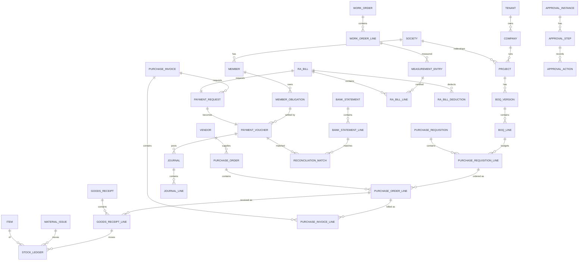

# Phase 4 — Database Design

**Document ID:** AICOS-DBD-001 · **Version:** 1.0
**Engine:** PostgreSQL 16 · **Executable DDL:** [`../db/ddl/`](../db/ddl)

---

## 1. Objective

Define a normalised, tenant-isolated, audit-complete schema that supports the full module set at 1,000+ projects and tens of millions of transactions, with financial invariants enforced by the database itself rather than only by application code.

---

## 2. Design principles

| # | Principle |
|---|---|
| P-1 | **Every business table carries `tenant_id`** and is protected by RLS. No exceptions. |
| P-2 | **Surrogate keys are `uuid` (v7, time-ordered)** — index-friendly, safe for offline generation on mobile. Human-facing identity is the `document_no`. |
| P-3 | **Money is `NUMERIC(18,4)`**, quantity `NUMERIC(18,4)`, percentages `NUMERIC(9,4)`. Floats are banned. |
| P-4 | **Nothing is hard-deleted.** `status` + `deleted_at` + `cancellation_reason`. |
| P-5 | **Every transactional table has** `created_at, created_by, updated_at, updated_by, version` (optimistic lock). |
| P-6 | **Header/line pattern** for all documents; line amounts roll up to the header with a checked tolerance. |
| P-7 | **Ledgers are append-only** (`stock_ledger`, `journal_line`, `audit_log`, `member_ledger_entry`); balances are materialised. |
| P-8 | **Polymorphic links** use `(entity_type, entity_id)` with a check constraint on the allowed type list, plus a partial index per type. |
| P-9 | **Effective-dated master data** (rates, prices, salary, tax) uses `effective_from`/`effective_to` with an exclusion constraint preventing overlap. |
| P-10 | **Enums are lookup tables** where the business may extend them; native PG enums only for engineering-owned, stable sets. |
| P-11 | Time is `timestamptz`, stored UTC, displayed IST. Business dates are `date`. |
| P-12 | Names are `snake_case`, singular table names, FK columns `<referenced_table>_id`. |

---

## 3. Schema organisation

| Schema | Contents |
|---|---|
| `core` | tenancy, identity, RBAC, DOA, workflow, numbering, audit, settings, attachments, notifications, outbox |
| `master` | company, project, society, member, vendor, item, cost head, GL account, bank, employee, customer, tax masters |
| `plan` | BOQ, budget, WBS, activity, schedule, norms |
| `proc` | PR, RFQ, quotation, PO, WO, amendments |
| `inv` | GRN, inspection, stock ledger/balance, issue, transfer, adjustment, batch |
| `site` | DPR, measurements, RA bills, NCR, quality, safety, labour, attendance |
| `fin` | journal, payables, payments, receipts, bank, reconciliation, retention, FUM |
| `comp` | GST, TDS, RERA, ROC, compliance calendar |
| `sales` | unit, lead, booking, demand, receipt allocation, customer |
| `hr` | employee lifecycle, payroll |
| `doc` | documents, versions, links, contracts, drawings, templates |
| `ai` | traces, extractions, embeddings, feedback, evals |
| `rpt` | KPI snapshots, report definitions, saved views, exceptions |

---

## 4. Core entity relationship map



### 4.1 The document lifecycle spine

Every approvable document shares the same shape, which is why one workflow engine serves all of them:

```
<doc>(id, tenant_id, company_id, project_id, document_no, document_date,
      status, version, total_amount, currency_code,
      approval_instance_id, content_hash,
      created_by, created_at, updated_by, updated_at,
      cancelled_at, cancellation_reason, deleted_at)
```

---

## 5. Key table specifications

### 5.1 `core.audit_log` (append-only, partitioned monthly)

| Column | Type | Notes |
|---|---|---|
| `id` | uuid v7 PK | |
| `tenant_id` | uuid | RLS |
| `entity_type` | text | `purchase_order`, `vendor`, … |
| `entity_id` | uuid | |
| `action` | text | `CREATE/UPDATE/APPROVE/REJECT/CANCEL/VIEW_SENSITIVE/EXPORT/LOGIN` |
| `actor_user_id` | uuid | null for system/job actors |
| `actor_type` | text | `USER`/`SYSTEM`/`AI_AGENT`/`CONNECTOR` |
| `before` / `after` | jsonb | changed fields only |
| `diff_keys` | text[] | for fast filtering |
| `reason` | text | mandatory for override/cancel actions |
| `ip`, `user_agent`, `request_id`, `trace_id` | | |
| `occurred_at` | timestamptz | partition key |
| `prev_hash`, `row_hash` | bytea | daily hash-chain anchoring |

`REVOKE UPDATE, DELETE ON core.audit_log FROM app_role;` — immutability enforced by grant, not by convention.

### 5.2 `inv.stock_ledger` (append-only) and `inv.stock_balance` (materialised)

`stock_ledger(id, tenant_id, project_id, store_id, item_id, batch_id, movement_type, quantity_in, quantity_out, rate, value_in, value_out, source_type, source_id, movement_date, created_at)`

`stock_balance(tenant_id, project_id, store_id, item_id, batch_id, quantity, value, avg_rate, last_movement_at)` — PK on the full grain, maintained by an `AFTER INSERT` trigger on `stock_ledger` with `SELECT ... FOR UPDATE`, and guarded by `CHECK (quantity >= 0)` so negative stock is structurally impossible (BR-MAT-04).

### 5.3 `fin.journal` / `fin.journal_line`

Balance is enforced by a deferred constraint trigger evaluated at commit:

```sql
CREATE CONSTRAINT TRIGGER trg_journal_balanced
AFTER INSERT OR UPDATE ON fin.journal_line
DEFERRABLE INITIALLY DEFERRED
FOR EACH ROW EXECUTE FUNCTION fin.assert_journal_balanced();
```

`journal_line` carries the full dimension set (`project_id`, `cost_head_id`, `wbs_node_id`, `party_type`, `party_id`, `boq_line_id`, `funding_source`) and is partitioned monthly on `posting_date`.

A `CHECK ((debit > 0 AND credit = 0) OR (credit > 0 AND debit = 0))` prevents the classic both-sides-populated bug.

### 5.4 `core.number_sequence`

`(tenant_id, series_key)` PK with `next_value bigint`. Allocation uses `pg_advisory_xact_lock(hashtext(series_key))` then `UPDATE ... RETURNING`, inside the document's transaction — gap-free because allocation and document insert commit together.

### 5.5 Effective-dated masters

```sql
CREATE TABLE master.item_price (
  ...,
  effective_from date NOT NULL,
  effective_to   date,
  EXCLUDE USING gist (
    tenant_id WITH =, item_id WITH =, vendor_id WITH =,
    daterange(effective_from, COALESCE(effective_to,'infinity'::date), '[)') WITH &&
  )
);
```

The same pattern applies to `tds_section_rate`, `tax_rate`, `salary_structure`, `member_obligation` escalation slabs and `doa_rule`.

### 5.6 `doc.document` and AI extraction

`document(id, tenant_id, type_id, storage_key, sha256, size_bytes, mime, ocr_status, page_count, legal_hold, retention_until, …)`
`doc.document_link(document_id, entity_type, entity_id, link_role)` — many-to-many to any business entity.
`ai.document_extraction(document_id, schema_name, model, prompt_version, extracted jsonb, confidence numeric, source_refs jsonb, reviewed_by, review_status)` — every extracted field keeps `{page, bbox}` so the UI highlights the source.
`ai.document_chunk(document_id, chunk_index, content, embedding vector(1024), tenant_id, project_id)` with an HNSW index and RLS — retrieval is filtered in SQL, never by prompt instruction.

### 5.7 Partitioning plan

| Table | Strategy | Retention |
|---|---|---|
| `core.audit_log` | RANGE monthly on `occurred_at` | 8 years (archive to S3 after 24 months) |
| `fin.journal_line` | RANGE monthly on `posting_date` | permanent |
| `inv.stock_ledger` | RANGE monthly on `movement_date` | permanent |
| `core.notification` | RANGE monthly | 12 months |
| `ai.ai_trace` | RANGE monthly | 12 months |
| `rpt.kpi_snapshot` | RANGE monthly | 5 years |

Partition creation is automated (`pg_partman` or a scheduled job creating the next 3 months).

---

## 6. Modelling the engagement model (Exec §C-4)

```sql
CREATE TYPE master.engagement_model AS ENUM (
  'SELF_REDEVELOPMENT_PMC',   -- society is developer; we are PMC/DM; fee revenue; FUM accounting
  'SOCIETY_REDEVELOPMENT_DEV',-- we are developer; full project P&L; RERA on us
  'DEVELOPMENT_MANAGEMENT',   -- third-party developer; DM fee
  'CONSTRUCTION_MANAGEMENT',  -- PMC fee only
  'CONSULTANCY'               -- feasibility / advisory
);
```

Consequences encoded in the schema:

| Aspect | `*_PMC` / `DM` / `CM` | `SOCIETY_REDEVELOPMENT_DEV` |
|---|---|---|
| Project bank account | Owned by society/client; flagged `is_fum = true` | Owned by our company |
| Cost postings | To `fin.fum_entry` against the society's fund ledger | To `fin.journal` as project cost/WIP |
| Our revenue | `fee_invoice` milestones only | Sale of units, POC recognition |
| RERA obligation | Society is promoter; we support | We are promoter |
| GST | Service fee 18% on our fee | Construction service, 1%/5% scheme rules |
| Flat sales | Society/other developer sells | We sell (`sales` schema active) |

`project.is_fum` derives from the engagement model and is `GENERATED ALWAYS AS ... STORED`, so no code path can set it inconsistently. Posting rules select the target ledger from this flag — the accounting separation is structural, not procedural (BRD BR-015).

---

## 7. Indexing strategy

| Pattern | Index |
|---|---|
| Every list screen | `(tenant_id, project_id, status, document_date DESC)` |
| Document lookup by number | `UNIQUE (tenant_id, company_id, document_no)` |
| FK joins | index every FK column (Postgres does not do this automatically) |
| Approval inbox | partial: `WHERE status = 'PENDING_APPROVAL'` on `(tenant_id, current_approver_id, submitted_at)` |
| Fuzzy vendor/item search | GIN `pg_trgm` on `name`, `alias` |
| Full-text document search | GIN on `to_tsvector('english', content)` |
| Vector retrieval | HNSW on `embedding vector_cosine_ops` |
| JSONB filters | GIN on `metadata` where queried |
| Duplicate invoice check | `UNIQUE (tenant_id, vendor_id, invoice_no, financial_year) WHERE deleted_at IS NULL` |
| Stock queries | `(tenant_id, project_id, item_id, store_id)` on balance; ledger on `(item_id, movement_date)` |

Rule: no index without a query that needs it; every slow-query-log entry over 200 ms is triaged weekly.

---

## 8. Data volume model (5-year projection at 500 projects)

| Table | Rows/project/year | 500 projects × 5 yrs | Notes |
|---|---|---|---|
| `journal_line` | ~60,000 | ~150 M | partitioned |
| `stock_ledger` | ~25,000 | ~62 M | partitioned |
| `audit_log` | ~200,000 | ~500 M | partitioned, archived |
| `purchase_order_line` | ~3,000 | ~7.5 M | |
| `dpr*` | ~4,000 | ~10 M | |
| `document` | ~8,000 | ~20 M | S3 objects; metadata in PG |
| `ai.document_chunk` | ~60,000 | ~150 M | consider separate instance at this scale |

At these volumes a single well-tuned RDS instance (r6g.2xlarge + read replica) remains viable; the partitioning and snapshot design is what makes that true.

---

## 9. Data integrity — what the database enforces itself

1. Journal balance (deferred constraint trigger).
2. Stock never negative (`CHECK` on materialised balance).
3. No duplicate vendor invoice (partial unique index).
4. Document total = Σ line totals within ₹1 (constraint trigger).
5. Approved documents immutable except through defined transitions (trigger comparing `status` transitions to an allowed-transition table).
6. Posting into a locked period blocked (trigger against `fin.financial_period`).
7. Effective-dated overlaps impossible (GiST exclusion constraints).
8. Audit log immutable (revoked grants).
9. Tenant isolation (RLS, `FORCE ROW LEVEL SECURITY`).
10. FK `ON DELETE RESTRICT` everywhere; nothing cascades away silently.

---

## 10. Migration and seeding

- **Forward-only** migrations, one concern per file, reviewed like code. Destructive changes require a two-step deploy (add → backfill → switch → drop in a later release).
- Zero-downtime rules: never rename in place (add new + backfill + dual-write + drop); add `NOT NULL` only with a default or after backfill; create indexes `CONCURRENTLY`.
- **Seed data:** permissions, roles, document types, workflow definitions, UOMs, standard chart of accounts (Indian construction), TDS sections, GST rates, cost-head templates, and a Maharashtra self-redevelopment configuration pack.
- **Legacy migration:** staging schema `mig.*` with raw imported Excel/Tally data, a cleansing pipeline with a validation report, and reconciled opening balances at a month-end cut-off. Migration order: masters → opening balances → open POs/PRs → open invoices/advances → stock → member obligations → documents.

---

## 11. Backup, retention, DR

RDS automated backups with **PITR (5-minute RPO)**, 35-day retention; nightly logical dumps to S3 with Glacier transition at 90 days and 8-year retention; S3 versioning + Object Lock for legal-hold documents; cross-region (`ap-south-2`) replication of backups; **quarterly restore drills with a documented, timed RTO** — a backup that has never been restored is not a backup.

---

## 12. Reports, dashboards, AI, security, future (per the mandated output format)

- **Reports/dashboards from the data layer:** all reporting runs on the read replica against `rpt.kpi_snapshot` and governed views (`rpt.v_*`), never against raw partitioned tables; every view carries the same RLS predicates as the base tables.
- **AI opportunities:** `pg_trgm` powers duplicate-master detection; `pgvector` powers document retrieval; `ai.feedback` (accepted/rejected suggestions) is the training signal that improves reconciliation and classification over time; query-plan analysis suggests missing indexes.
- **Security:** RLS + column encryption for PAN/Aadhaar/bank + revoked grants on audit + separate roles for app / migration / read-only analytics / auditor.
- **Future enhancements:** logical replication to a warehouse, Citus sharding by `tenant_id` if a single instance is outgrown, temporal (system-versioned) tables for full point-in-time reconstruction, and a per-tenant encryption-key hierarchy for enterprise SaaS customers.
