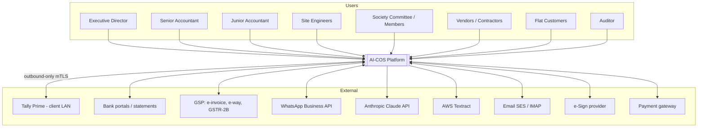
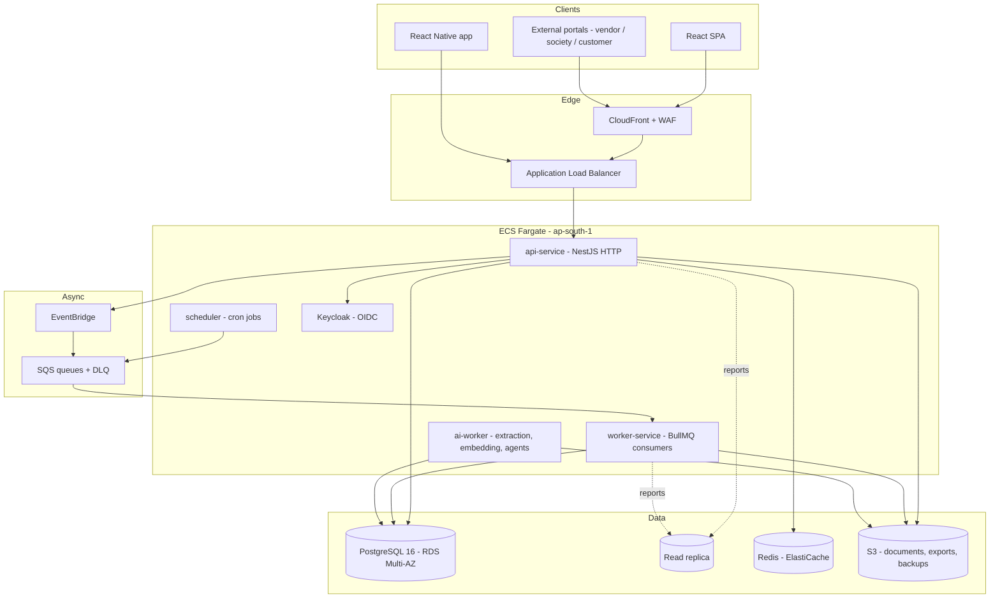
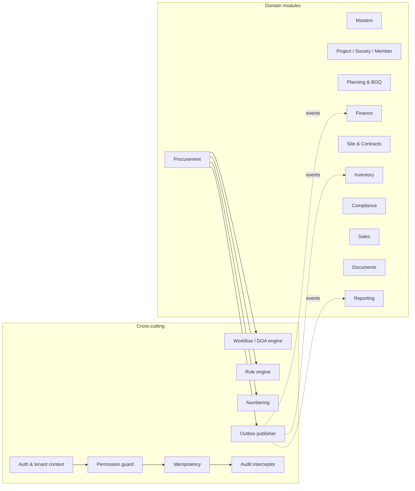
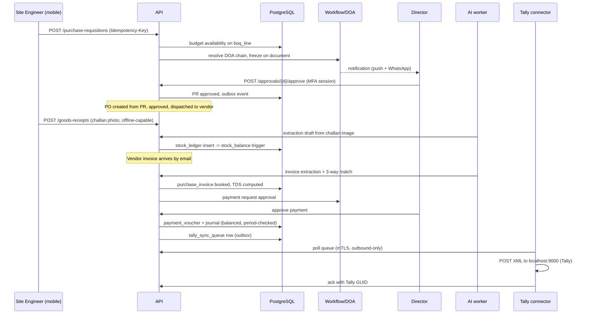

# Phase 5 — System Architecture

**Document ID:** AICOS-ARC-001 · **Version:** 1.0

---

## 1. Objective

Define the deployed shape of the system — components, boundaries, data flows, environments, capacity, resilience and cost — at a level a DevOps team can build from and a CTO can review.

---

## 2. Context (C4 level 1)



---

## 3. Container view (C4 level 2)



**One codebase, four run modes** (`RUN_MODE=api|worker|scheduler|ai`) — the same image, different entrypoint. This keeps deployment simple while allowing independent scaling: workers scale on queue depth, API on request rate.

---

## 4. Component view — the modulith inside `api-service`



Modules never call each other's repositories. Synchronous cross-module reads go through a published read interface; cross-module writes go through events only (Phase 3 §3.1).

---

## 5. Key data flows

### 5.1 Purchase-to-pay



### 5.2 Bank reconciliation

```
Statement (upload / IMAP / AA)
  → parse (native CSV, or Textract + Claude for PDF)
  → validate balance continuity, reject on gap
  → rule matcher (amount + UTR + date window)      → auto-match if confidence ≥ 0.95 AND exact ref
  → AI matcher (narration → party, history, fuzz)  → suggestion queue
  → accountant one-click accept / manual match / create-transaction-from-line
  → GL posting → outbox → Tally sync
  → every accept/reject written to ai.feedback (improves the next match)
```

### 5.3 Offline site capture

```
Device: capture (DPR/GRN/measurement/photo) → local SQLite → mutation queue
  ↳ photos: direct presigned multipart upload to S3, resumable
  ↳ on connectivity: POST /sync/batch with client-generated UUIDs
Server: idempotent upsert → validate → apply → return per-item result
  ↳ conflict → returned to device for explicit resolution (never last-write-wins)
Device: pull delta since cursor for reference data (items, vendors, open POs, BOQ lines)
```

---

## 6. Environments

| Env | Purpose | Infrastructure | Data |
|---|---|---|---|
| `local` | development | Docker Compose: Postgres, Redis, MinIO, Keycloak, mock Tally, mock GSP | seeded fixtures |
| `dev` | integration | 1 × Fargate task per service, single-AZ RDS `t4g.medium` | synthetic |
| `staging` | UAT, migration rehearsal, perf tests | production topology at reduced size | anonymised production-shaped |
| `production` | live | Multi-AZ, auto-scaling | live |

Promotion is by immutable image digest — the exact artefact tested in staging is what runs in production. Configuration differs; code does not.

---

## 7. Deployment topology (production)

```
Route 53 → CloudFront (SPA + static, WAF) → ALB (private subnets)
  ├── api-service        : Fargate, 2–10 tasks (0.5 vCPU / 1 GB → scale on CPU + RPS)
  ├── worker-service     : Fargate, 2–8 tasks  (scale on SQS depth)
  ├── ai-worker          : Fargate, 1–4 tasks  (scale on AI queue depth)
  ├── scheduler          : Fargate, 1 task     (leader-elected cron)
  └── keycloak           : Fargate, 2 tasks
Data: RDS PostgreSQL 16 Multi-AZ (db.r6g.large → r6g.2xlarge) + 1 read replica
      ElastiCache Redis (cache.t4g.small, Multi-AZ)
      S3 (documents, exports, backups) with lifecycle → Glacier
Network: 3 AZs, public subnets (ALB/NAT only), private-app, private-data
Secrets: Secrets Manager + KMS CMKs (separate keys for DB, documents, connector creds)
```

**Why not Kubernetes:** at 4–8 engineers and this workload, EKS adds a full-time operational surface (control-plane upgrades, ingress, autoscaler, network policy) for no functional gain. Fargate delivers the same isolation and autoscaling. If the platform reaches multi-region SaaS scale, the containers move to EKS unchanged.

---

## 8. Scalability model

| Dimension | Approach | Trigger to act |
|---|---|---|
| API throughput | horizontal Fargate scaling, stateless tasks | CPU > 65% or P95 > 400 ms for 5 min |
| Background work | queue-depth-based worker scaling; separate queues per class (sync, ai, report, notify) so a slow AI job never blocks a payment notification | depth > 100 or oldest message > 2 min |
| Database reads | read replica for all reporting/analytics; add replicas as needed | replica lag < 30 s must hold |
| Database writes | vertical scaling first (r6g.large → 4xlarge covers the 5-year projection), then partition pruning, then Citus sharding by `tenant_id` | write IOPS > 70% sustained |
| Large tables | monthly range partitions with automated creation and S3 archival | per Phase 4 §5.7 |
| Documents | S3 scales without action; CloudFront for delivery | — |
| Vectors | `pgvector` HNSW; move `ai.document_chunk` to a dedicated instance past ~50M chunks | index build time > 1 h |
| Multi-tenant noise | per-tenant rate limits and AI budgets; heavy tenants can be pinned to a dedicated DB in a future enterprise tier | — |

**Capacity check for the stated target** (500 concurrent users, 1,000 projects): 500 concurrent users at ERP interaction rates ≈ 50–80 sustained RPS with peaks near 250 RPS. At ~15 ms median query time, a single `db.r6g.2xlarge` (8 vCPU) with connection pooling (PgBouncer transaction mode, 100 server connections) has substantial headroom. The binding constraint is not the target load — it is unbounded report queries, which is why reporting is confined to the replica and to pre-computed snapshots.

---

## 9. Availability and resilience

| Concern | Design |
|---|---|
| AZ failure | Multi-AZ RDS with automatic failover; tasks spread across 3 AZs |
| Task failure | ECS health checks + rolling replacement; `/health` (liveness) and `/ready` (DB + Redis reachable) |
| Deploy failure | Blue/green with automated rollback on alarm (5xx rate, P95 latency) |
| Database failure | Multi-AZ failover (typically 60–120 s); PITR to any 5-minute point in 35 days |
| Region failure | Backups replicated to `ap-south-2`; documented 4-hour restore runbook (RTO 4 h). Active-active multi-region is explicitly out of scope — the cost is not justified at this stage |
| External dependency failure | Circuit breakers per connector; queued retry with backoff; the core ERP stays fully usable when Tally, GSP, WhatsApp or the AI provider is down. **No user-facing flow blocks on an AI call** |
| Poison messages | DLQ per queue with alerting and a replay tool |
| Data corruption | Append-only ledgers, immutable audit, daily logical backup independent of RDS snapshots |

**Degradation ladder for AI:** primary model → cheaper model → cached/heuristic result → manual entry with a banner. The system never becomes unusable because an AI provider is unavailable.

---

## 10. Security architecture

```
Internet → WAF (OWASP CRS, rate limit, geo rules) → CloudFront → ALB (TLS 1.3)
  → API tasks in private subnets (no public IP, no SSH; SSM Session Manager only)
    → RDS / Redis in isolated data subnets, security-group-restricted to app tasks
    → S3 via VPC gateway endpoint (no traffic over the internet)
    → Secrets Manager via interface endpoint
```

Identity flow: browser → Keycloak (OIDC Authorization Code + PKCE) → access token (15 min) + refresh (12 h, rotating, reuse-detected) → API validates JWT signature and tenant claim → request context → RLS session variables → database.

Defence in depth: permission checked in the guard **and** enforced by RLS. A missing guard is a bug; a missing RLS policy fails the build (Phase 3 §4).

Detail in Phase 10 §7 (operations) and Phase 3 §12 (application).

---

## 11. Observability architecture

| Signal | Tooling | Key items |
|---|---|---|
| Traces | OpenTelemetry → AWS X-Ray / Tempo | HTTP → use-case → SQL → external call, with `tenantId`, `documentId` |
| Metrics | OTel → CloudWatch / Prometheus → Grafana | RED per endpoint; queue depth & age; DB connections, replica lag; Tally sync lag; AI cost/day; auto-match rate |
| Logs | structured JSON → CloudWatch Logs → Loki (optional) | `traceId`, `tenantId`, `userId`, `requestId`; PII redacted at the logger |
| Errors | Sentry | release-tagged, source-mapped, tenant-tagged |
| Business KPIs | `rpt.kpi_snapshot` → Grafana | approvals pending/aged, unreconciled bank lines, DPR compliance, AI acceptance rate |
| Synthetic | scheduled checks | login, create PR, Tally heartbeat, statement parse |

**Alerts that page someone:** payment run failure · Tally drift > ₹1 at close · DB failover · error rate > 2% for 5 min · queue age > 15 min · AI spend > 150% of daily budget · backup failure · security-group or IAM drift.

---

## 12. Cost model (indicative, monthly, INR)

| Component | Wave 1 (3 projects, ~10 users) | Wave 3 (50 projects, ~80 users) |
|---|---|---|
| ECS Fargate | 8,000 | 35,000 |
| RDS Multi-AZ + replica | 14,000 | 55,000 |
| ElastiCache | 2,500 | 6,000 |
| S3 + CloudFront | 2,000 | 12,000 |
| Data transfer, NAT | 3,000 | 9,000 |
| Backups / DR | 2,500 | 8,000 |
| Claude API (routed) | 15,000 | 60,000 |
| Textract | 2,000 | 10,000 |
| WhatsApp BSP + SMS | 3,000 | 12,000 |
| GSP | 3,000 | 8,000 |
| Observability (Sentry, Grafana Cloud) | 4,000 | 12,000 |
| **Total** | **≈ 59,000** | **≈ 2,27,000** |

Cost controls: Fargate Spot for workers (not API), Graviton instances, S3 lifecycle policies, aggressive AI caching and model routing, per-tenant AI budgets, scheduled scale-down of non-production environments outside business hours.

---

## 13. Architecture decision records (index)

| ADR | Decision | Status |
|---|---|---|
| ADR-001 | Modular monolith over microservices | Accepted |
| ADR-002 | PostgreSQL as single primary datastore (OLTP + FTS + vectors) | Accepted |
| ADR-003 | Shared-schema multi-tenancy with RLS | Accepted |
| ADR-004 | AI-COS as accounting master; Tally as one-way downstream mirror | Accepted |
| ADR-005 | ECS Fargate over EKS | Accepted |
| ADR-006 | React Native over Flutter/PWA for mobile | Accepted |
| ADR-007 | Keycloak over Cognito/Auth0 | Accepted |
| ADR-008 | In-house agent runtime over an orchestration framework | Accepted |
| ADR-009 | Offline support limited to site capture | Accepted |
| ADR-010 | AWS `ap-south-1` for data residency | Accepted |
| ADR-011 | Outbound-only Tally connector agent | Accepted |
| ADR-012 | Human approval required for every financial state change | Accepted, non-negotiable |

Each ADR is maintained as a file in `docs/adr/` with context, options considered, decision, consequences, and a revisit trigger.

---

## 14. Reports, dashboards, AI, security, future (mandated format)

- **Reports/dashboards from the architecture:** system-health dashboard (§11), capacity and cost dashboards, integration health, AI spend and acceptance-rate reporting.
- **AI opportunities in the architecture itself:** anomaly detection on operational metrics; log-pattern clustering to surface novel errors; query-plan regression detection; automated runbook suggestion on alert.
- **Security requirements:** §10, plus quarterly access review, annual penetration test, dependency and container scanning in CI, and IaC drift detection.
- **Future enhancements:** multi-region active-passive DR · dedicated-instance tier for enterprise tenants · Citus sharding · event streaming (Kafka/Kinesis) if event volume outgrows SQS · edge caching for portals · on-premise deployment option for tenants with data-control requirements.
