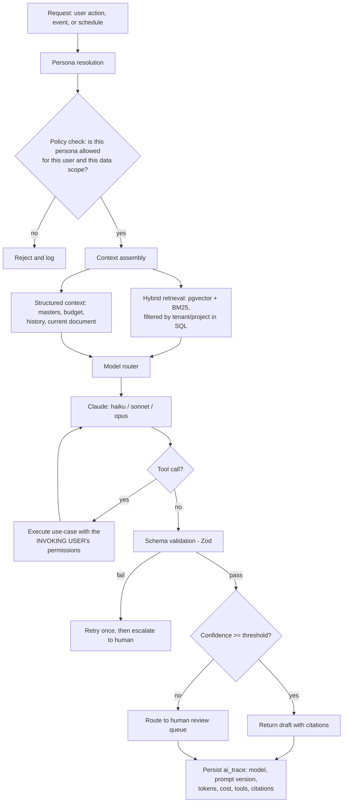

# AI Architecture — Agents, Extraction, Retrieval & Guardrails

**Document ID:** AICOS-AI-001 · **Version:** 1.0
**Related:** Phase 3 §11 (plumbing) · Phase 7 §10 (tool API) · Phase 9 §8 (evaluation)

---

## 1. Objective

Deliver the twenty-one "AI roles" in the brief as **one governed runtime with configurable personas** (Exec §C-6) — measurably accurate, cost-controlled, and structurally incapable of moving money on its own.

**The governing rule, restated because everything below depends on it:**

> **AI prepares. Humans approve. Every AI output carries a confidence score and a citation to its source.**

---

## 2. What AI actually does here

| Class | Examples | Risk | Autonomy |
|---|---|---|---|
| **Extract** | Invoice, challan, bank statement, agreement clause, LDC, GST certificate | Medium — wrong data enters a draft | Draft only; human confirms |
| **Match** | Bank line ↔ voucher, invoice ↔ PO ↔ GRN, contractor bill ↔ our measurements | Medium | Auto only above a strict threshold; otherwise suggest |
| **Summarise** | Approval briefs, agreement digests, meeting minutes, variance explanations | Low | Read-only |
| **Detect** | Duplicates, rate outliers, split-PO patterns, consumption anomalies, unusual bank activity | Low — advisory | Alert only |
| **Predict** | Cash flow, material requirement, delay, cost-to-complete, vendor risk | Low — advisory | Advisory with ranges |
| **Draft** | POs, demand letters, vendor chase emails, member communications, DPR narrative | Low | Human sends |
| **Answer** | Conversational query over permitted data | Medium — data exposure | Read-only, RLS-enforced |

**Deliberately absent:** approving, posting, paying, releasing, filing. No persona has a tool for any of these (Phase 7 §10).

---

## 3. Runtime architecture



### 3.1 Personas as configuration

A persona is a database row, not a codebase:

```jsonc
{
  "key": "ai_accountant",
  "display_name": "AI Accountant",
  "system_prompt_ref": "prompts/accountant/v7",
  "tools": ["search_documents", "extract_invoice", "suggest_bank_match",
            "query_ledger", "get_vendor_history"],
  "data_scope": "company",           // tenant | company | project | own_records
  "model_policy": "cost_optimised",  // or "accuracy_first"
  "max_tokens_per_task": 8000,
  "requires_human_approval": true,   // always true for anything that produces a document
  "allowed_roles": ["SENIOR_ACCOUNTANT", "JUNIOR_ACCOUNTANT"]
}
```

Adding "AI HR" in Wave 3 is a configuration row plus a prompt file plus an evaluation set — not a project. The brief's twenty-one AI roles map onto this as:

| Brief's AI role | Persona | Tools it actually gets |
|---|---|---|
| AI Director | `ai_director` | portfolio summary, exception ranking, approval briefs, cash position — **read-only** |
| AI Accountant | `ai_accountant` | invoice extraction, bank matching, ledger query, classification |
| AI Site Engineer | `ai_site_engineer` | DPR drafting, progress summary, material requirement, photo analysis |
| AI Purchase Officer | `ai_purchase_officer` | vendor suggestion, rate comparison, quotation extraction, PO drafting |
| AI Inventory Manager | `ai_inventory` | consumption variance, reorder suggestion, challan extraction |
| AI Legal Officer | `ai_legal` | clause extraction, obligation extraction, agreement summary, expiry watch |
| AI HR / AI Sales | `ai_hr`, `ai_sales` | Wave 3 — same pattern |
| AI OCR / Invoice Reader / Bank Reconciliation / Duplicate Detection | not personas — they are **pipelines** (§5, §6) invoked by the above |
| AI Cash Flow / Material / Delay Predictor, Risk Analysis, Vendor Performance | not personas — they are **scheduled analytical jobs** (§8) whose outputs feed dashboards |

Collapsing twenty-one "products" into six personas, three pipelines and a set of jobs is the difference between a maintainable system and twenty-one things to keep working.

---

## 4. Model routing

| Task class | Model | Why |
|---|---|---|
| Document classification, field extraction from clean documents, narration→party matching, tagging | `claude-haiku-4-5` | High volume, low complexity; cheapest per document |
| Reconciliation reasoning, approval summaries, multi-step agent tasks, drafting, conversational query | `claude-sonnet-5` | The workhorse — good judgement at moderate cost |
| Development/PAAA agreement analysis, feasibility reasoning, anomaly investigation, difficult scanned documents | `claude-opus-5` | Reserved for genuinely hard reasoning |

Routing rules: start at the cheapest tier capable of the task class → **escalate on low confidence** (a Haiku extraction below 0.85 is re-run on Sonnet) → escalate on validation failure → cap escalations at one per task. Escalation rate is a monitored metric; if it exceeds 15% for a task class, the default tier for that class is wrong.

Prompt caching is used aggressively for the stable prefix (system prompt, schema, few-shot examples), which typically dominates token cost in extraction workloads. Every response is cached by `(document sha256, schema version, prompt version)` — re-processing the same invoice costs nothing.

---

## 5. Document extraction pipeline

```
Upload / email / WhatsApp / mobile capture
  → virus scan → store in S3 → classify document type (Haiku, cheap)
  → route:
      • structured native (CSV/XLSX/e-invoice JSON) → deterministic parser, no LLM
      • table-heavy scan (bank statement, BOQ) → Textract for layout + LLM for semantics
      • semi-structured (invoice, challan) → LLM vision with a typed schema
      • long-form (agreement, notice) → chunk → targeted clause extraction
  → validate: schema (Zod), arithmetic (taxable + tax = total), master lookups
              (GSTIN exists and is active, vendor known, HSN plausible)
  → cross-check against the business context (open POs, GRNs, budget)
  → confidence per field + overall
  → thresholds:
      ≥ 0.95 and all validations pass  → pre-filled draft, fields shown green
      0.75–0.95                        → draft with flagged fields, focus on the lowest
      < 0.75                           → manual entry with the document shown alongside
  → human reviews, corrects, books  → corrections written to ai.feedback
```

**Every extracted field carries `{value, confidence, source_ref:{page, bbox}}`** so the reviewer can click a field and see exactly where it came from. This one design choice does more for trust than any accuracy percentage.

**Deterministic beats probabilistic wherever possible:** an e-invoice IRN JSON is parsed, not inferred; a CSV statement is parsed, not read. The LLM is used where structure genuinely is absent.

---

## 6. Bank reconciliation intelligence

Three layers, in order, because the cheapest correct answer should win:

1. **Deterministic rules** — exact amount + UTR/cheque reference + date window. Auto-matched, no model call, no cost. This should handle the majority of lines once UTRs are captured on payment vouchers.
2. **Learned rules** — tenant-specific narration patterns accumulated from confirmed matches (`fin.reconciliation_rule`, hit-counted). Also free.
3. **LLM matching** — only for what survives: narration → party resolution, partial matches, bulk transfers, and lines needing a created transaction.

**Auto-post requires all of:** confidence ≥ 0.95, exact amount match, and a corroborating reference. Everything else is a *suggestion* that a human accepts with one keystroke. Precision is protected over recall — a wrong auto-match costs more to unwind than a manual match costs to make.

Every accept/reject writes to `ai.feedback`, which both improves rule generation and forms the next evaluation set.

---

## 7. Retrieval (RAG)

| Aspect | Design |
|---|---|
| Chunking | Semantic, ~800 tokens with 100-token overlap, preserving page and section metadata |
| Embedding | 1024-dim, stored in `ai.document_chunk`, HNSW index |
| Hybrid search | Vector similarity + BM25 (`ts_rank`), reciprocal-rank fusion, then re-rank the top 20 to the top 5 |
| **Scoping** | Tenant and project filters are applied **in the SQL predicate** and reinforced by RLS. Scope is never expressed as an instruction in the prompt — a prompt is a request, a `WHERE` clause is a guarantee |
| Freshness | Documents are chunked and embedded on the outbox event; typical lag under 2 minutes |
| Citations | Every retrieved chunk carries `document_id`, page range and a signed preview link; answers without citations are suppressed |

---

## 8. Predictive and analytical jobs

These are scheduled jobs, not chat.

| Job | Method | Output |
|---|---|---|
| Cash-flow forecast (13 weeks) | Deterministic model over PO schedules, invoice due dates, member obligations, collections and payroll; LLM used only to narrate drivers | Range with named drivers, on the treasury dashboard |
| Material requirement | Schedule × consumption norms × lead time × current stock | Draft PRs for engineer confirmation |
| Delay prediction | Productivity trend, manpower, hindrance history, weather | Activity-level risk flags |
| Cost-to-complete | Earned value (CPI/SPI) plus trend, not linear extrapolation | Forecast with confidence band |
| Vendor risk | On-time %, rejection %, price variance, compliance gaps, payment behaviour | Score with contributing factors |
| Duplicate & anomaly sweep | Fuzzy matching (`pg_trgm`), amount/date proximity, image hashing, rule patterns | Exception feed entries |

**Statistics do the arithmetic; the model explains it.** Asking a language model to forecast cash flow numerically would be a mistake — asking it to explain why the forecast moved is exactly right.

---

## 9. Guardrails

| Threat | Control |
|---|---|
| **Prompt injection** via invoices, emails, WhatsApp messages, uploaded PDFs | All document and message content is wrapped as untrusted data with explicit delimiters; instructions inside it are never followed; tools are allow-listed per persona; outputs are schema-validated; an adversarial corpus is tested in CI with a required **0% unsafe-action rate** (Phase 9 §7) |
| **Privilege escalation** | Tools execute with the invoking user's permissions and RLS context — never a service account. An agent can never see or do more than the human who triggered it |
| **Unauthorised financial action** | No approve/post/pay/release tool exists in any persona. This is enforced by the tool registry, not by prompt wording |
| **Data exfiltration** | Retrieval is SQL-scoped; conversational answers respect RLS; no cross-tenant embedding store; outputs are logged |
| **Hallucinated values** | Typed schema validation; arithmetic cross-checks; master-data existence checks; a value with no source citation is rejected before it reaches the user |
| **Overconfidence** | Confidence calibration is tested per release (Phase 9 §8); miscalibration is a defect because thresholds depend on it |
| **Silent drift** | Prompts and models are versioned; every trace records both; golden-set evaluations gate every change; 5% of production extractions are sampled for human review |
| **Cost runaway** | Per-tenant daily budgets with soft alert and hard degradation; per-task token caps; caching; routing |
| **Provider outage** | Degradation ladder: primary model → cheaper model → cached/heuristic → manual entry with a banner. **No user-facing flow ever blocks on an AI call** |

---

## 10. Prompt and evaluation management

Prompts are versioned files in `packages/ai-kit/prompts/<persona>/<version>.md`, reviewed like code. Each has an evaluation set in `packages/ai-kit/evals/`. A prompt or model change runs the full suite in CI; a regression beyond tolerance blocks the merge (Phase 9 §8 has the metrics and gates).

Production traces (`ai.ai_trace`) record model, prompt version, tokens, cost, latency, tools called and outcome — making it possible to answer "why did the system extract ₹4,25,000 from that invoice on 12 June?" six months later, which is precisely what an auditor will ask.

---

## 11. Cost model

| Workload | Volume assumption | Model | Indicative monthly cost |
|---|---|---|---|
| Invoice extraction | 600/month | Haiku, cached prefix | low |
| Bank statement parsing | 12 statements × 300 lines | Textract + Sonnet | low |
| Reconciliation suggestions | ~600 residual lines | Sonnet | moderate |
| Approval summaries | ~400/month | Sonnet | low |
| Agreement analysis | ~20/month | Opus | moderate |
| Conversational queries | ~500/month | Sonnet | moderate |

Cost per unit of work is tracked as a product metric: **cost per invoice processed** must stay well below the fully loaded cost of manual keying, and this is reported monthly. If a feature cannot clear that bar, it is switched off — AI is a tool here, not an objective.

---

## 12. Ethics, privacy and disclosure

AI-generated content is always visibly labelled (the reserved violet `ai` token, Phase 6 §4). Member and employee personal data is minimised in prompts — identifiers are passed as references, not raw PAN or Aadhaar. Face-recognition attendance (if adopted) requires explicit consent, stores templates rather than images, and is subject to DPDP obligations. No tenant's data is used to train shared models; the improvement loop is per-tenant, stored in `ai.feedback`, and used for retrieval and rule generation — not for model fine-tuning across tenants.

---

## 13. Roadmap

**Wave 1:** invoice/challan/statement extraction · reconciliation suggestions · approval summaries · duplicate detection.
**Wave 2:** conversational query over the semantic layer · agreement clause extraction · vendor chase drafting · consumption anomaly detection · WhatsApp assistant.
**Wave 3:** predictive suite · meeting assistant with Marathi/Hindi transcription · photo-based progress estimation · feasibility first-draft generation · automated board pack.
**Wave 4:** cross-tenant benchmarking (opt-in, anonymised) · per-tenant fine-tuning where volume justifies it · voice-first site capture.
